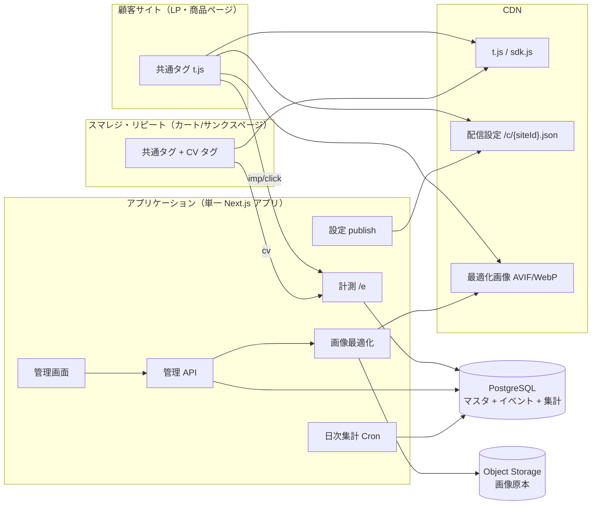
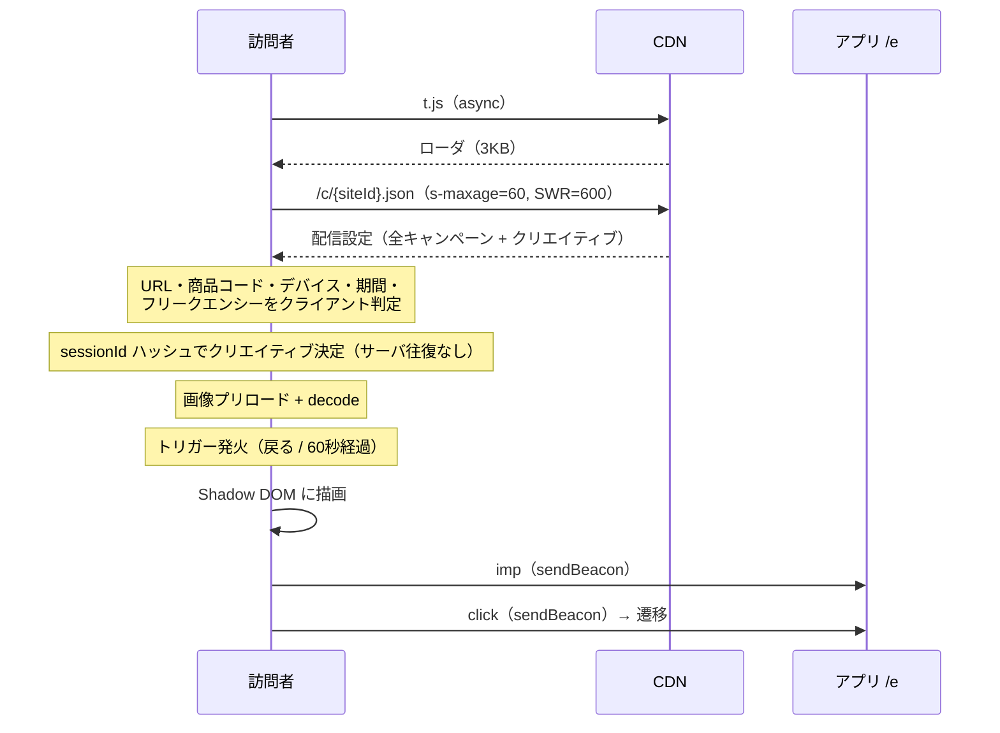
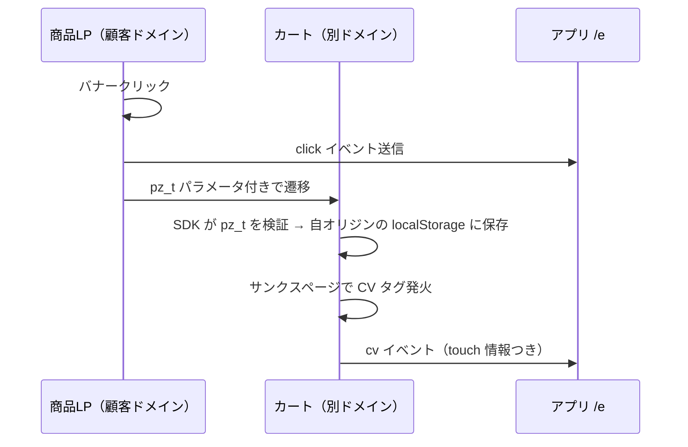

# 02. システム全体構成

## 0. 前提条件（確定）

| 項目 | 確定内容 | 設計への影響 |
| --- | --- | --- |
| カート | **スマレジ・リピート** | カートドメインが別ドメインの場合、CV 計測にドメイン跨ぎ対策が必須 → `09-cart-integration.md` |
| 商品コード | **タグで渡せる** | ページグループを URL ルールで組む必要がない。商品コードを一次キーにできる |
| 想定規模 | **月間 1 万 PV 程度**（拡大可能性あり） | ClickHouse・Redis・キューは**不要**。PostgreSQL 一本で構築する |
| 提供形態 | **SaaS / 複数アカウント運用** | マルチテナント設計が必須 → `10-multitenancy.md` |

### 規模に対する設計方針

月間 1 万 PV は、イベント量にすると **imp 1,000〜2,000 件 / 月**程度です。
初期設計で ClickHouse・Redis・メッセージキューを入れると、**運用コストと障害点が
得られる価値を大きく上回ります**。Phase 1 は PostgreSQL 一本の単純構成とし、
100 倍（月間 100 万 PV）まではこの構成のまま耐えられる設計にします。

スケール時の分岐点は「9. スケール計画」に明記します。

---

## 1. コンポーネント全体像（Phase 1 構成）



**構成要素はたった 4 つ**: CDN / Next.js アプリ / PostgreSQL / オブジェクトストレージ。

## 2. 技術スタック（確定案）

| 領域 | 選定 | 理由 |
| --- | --- | --- |
| SDK / ローダ | TypeScript + esbuild（依存ゼロ・IIFE） | サイズ最小化。Shadow DOM で CSS 隔離 |
| アプリ | **Next.js (App Router) 単一アプリ** | 管理画面・管理 API・計測エンドポイント・配信設定生成を 1 デプロイに集約 |
| ホスティング | Vercel もしくは Cloud Run | この規模ならサーバーレスで十分。運用ゼロ |
| DB | **PostgreSQL**（Supabase / RDS / Cloud SQL） | マスタもイベントも集計も 1 つで賄う。RLS でテナント分離 |
| 配信設定 | Next.js Route Handler + CDN キャッシュ | 静的 JSON を CDN に置くのと同等の性能を、publish 処理なしで得る |
| 画像 | Sharp + Object Storage + CDN | AVIF / WebP / 2x 生成 |
| 認証 | Auth.js（メール + パスワード / Google SSO） | マルチテナントのメンバー招待に対応 |
| 集計 | Cron（Vercel Cron / Cloud Scheduler） | 日次ロールアップ。当日分は生イベント直クエリで足りる |
| 監視 | Sentry（フロント SDK 含む） + ログ | SDK の例外を顧客サイトごとに把握 |

### 廃止した構成要素と理由

| 当初案 | 廃止理由 |
| --- | --- |
| ClickHouse | 月間 2,000 イベントに列指向 DB は不要。Postgres で 3 桁倍の余裕がある |
| Redis（配信ローテーション） | **ハッシュによる決定論的ローテーション**に変更し、サーバ状態を不要にした（次項） |
| メッセージキュー | 計測リクエストを直接 DB に INSERT して問題ない量。障害点を増やさない |
| Edge Functions（/d /e 分離） | 通常のアプリの Route Handler で十分。デプロイ対象を 1 つに保つ |
| CDN への設定 publish バッチ | Route Handler + `s-maxage` で同等。publish 失敗という障害モードを消せる |

## 3. 均等配信：状態を持たない決定論的ローテーション

Redis カウンタをやめ、**セッション ID のハッシュ**でクリエイティブを決定します。

```ts
// packages/shared/rotation.ts
export function pickCreative(sessionId: string, campaignId: number, creatives: Creative[]) {
  const actives = creatives.filter(c => c.status === 'active');
  if (actives.length === 0) return null;

  // FNV-1a 32bit
  let h = 0x811c9dc5;
  const key = `${sessionId}:${campaignId}`;
  for (let i = 0; i < key.length; i++) {
    h ^= key.charCodeAt(i);
    h = Math.imul(h, 0x01000193);
  }
  const total = actives.reduce((s, c) => s + c.weight, 0);
  let r = (h >>> 0) % total;
  for (const c of actives) { if (r < c.weight) return c; r -= c.weight; }
  return actives[actives.length - 1];
}
```

この方式の利点:

| 論点 | 結果 |
| --- | --- |
| 均等性 | ハッシュが一様分布のため、1,000 imp 時点で偏り ±3% 以内（テストで検証） |
| セッション内の一貫性 | 同一セッションでは必ず同じクリエイティブ（リロードで別バナーが出ない） |
| セッションを跨ぐと変わる | 再訪時は別パターンを見せられる（`sessionId` が変わるため） |
| サーバ状態 | **不要**。`/d` エンドポイント自体が消える |
| オフライン / API 障害 | 影響なし。設定 JSON さえあれば動く |
| 重み付け | `weight` にそのまま対応（将来の勝ちパターン寄せに拡張可能） |

同じ関数を管理画面の「配信比率」表示でも使うため `packages/shared` に置きます。

## 4. 配信シーケンス



**訪問者から見たネットワークリクエストは、表示されない場合わずか 2 本**（`t.js` と設定 JSON）。
どちらも CDN キャッシュヒットするため、顧客サイトの表示速度への影響は実質ゼロです。

## 5. ドメインを跨ぐ CV 計測（最重要論点）

スマレジ・リピートでは、**商品 LP と カート / サンクスページのドメインが異なる**構成が
一般的です。ブラウザのストレージはオリジン単位で分離されるため、
LP 側で保存した接触情報（`pz.touch`）をサンクスページから読むことはできません。

### 5.1 解決策：クリック時のリンク装飾（クリックスルー CV）

**バナーのクリックは、こちらが URL を発行する遷移そのもの**です。
したがってリンク先 URL に接触情報を付与すれば、ドメインが変わっても確実に引き継げます。

```
https://cart.example.com/item/1001
  ?pz_t=<base64url({vid, sid, cid, crid, ts, sig})>
```



- `sig` は配信設定に含まれるサイト鍵での HMAC（改ざん・自作 CV の防止）
- カート側で受け取ったら **即座に URL から `pz_t` を削除**（`history.replaceState`）してユーザーに見せない
- カート内での回遊・カゴ落ち後の再訪にも耐えるよう、カート側オリジンの localStorage に 7 日保持

**この方式により、主要指標であるクリックスルー CV はドメインを跨いでも 100% 計測できます。**

### 5.2 ビュースルー CV の扱い

表示のみでクリックしなかった訪問者は、こちらが遷移 URL を発行しないため
装飾できません。よって**ドメインが分かれる場合、ビュースルー CV は原理的に計測不可**です。

| 構成 | クリックスルー CV | ビュースルー CV |
| --- | --- | --- |
| LP とカートが同一ドメイン | ✓ | ✓ |
| LP とカートが別ドメイン | ✓（リンク装飾） | ✗（計測不可） |

対応方針:

1. まず**カートのドメイン構成を確認する**（独自ドメイン設定が可能なら同一ドメイン化が最善）
2. 別ドメインのままの場合、管理画面のレポートで**ビュースルー列を非表示**にし、
   「この構成では計測できません」と明示する（0 件と表示して誤解を生まない）
3. 全体効果は **holdout（対照群）による増分 CVR** で測る。
   こちらはドメインを跨がず、サイト全体の CV 数の差分で見られるため、
   ビュースルー分を含めた真の効果を捕捉できる

> ビュースルーが取れないぶん、**対照群の設計価値がさらに上がります**。
> 初期リリースから holdout を入れることを強く推奨します。

### 5.3 カート側にタグを設置できない場合

スマレジ・リピート側で JS タグを自由に設置できない可能性があるため、
代替として **S2S コンバージョン API**（`04-api.md` 1.4）を用意します。
`pz_t` を注文メモ等に保持できれば、受注データ連携から CV を送信できます。
詳細は `09-cart-integration.md`。

## 6. マルチテナント（SaaS）

- 1 アカウント（テナント）= 1 契約。配下に複数サイト・複数ユーザー
- PostgreSQL の **Row Level Security** で `account_id` によるデータ分離を DB レベルで強制
- 計測エンドポイントは `sitePublicId` からテナントを解決（アプリ層で越境不可）
- プラン別のクォータ（サイト数・月間 imp 数・ユーザー数）と使用量メータリング
- 詳細は `10-multitenancy.md`

## 7. 環境構成

| 環境 | 用途 |
| --- | --- |
| local | Docker Compose（Postgres + MinIO） |
| staging | 本番同等。テスト用 EC モックサイトに実際にタグを設置して検証 |
| production | 顧客配信 |

- SDK は `sdk.<contenthash>.js` で immutable キャッシュ。設定 JSON に URL を含めて版を切替
- ロールバックは「設定 JSON が指す SDK バージョンを戻す」だけで完了する

## 8. 障害時のふるまい

| 障害 | ふるまい |
| --- | --- |
| 設定 JSON 取得失敗 | 何も表示しない（顧客サイトに一切影響を出さない） |
| アプリ全体がダウン | CDN キャッシュで**配信は継続**。計測のみ欠損 → SDK が localStorage にキューし再送 |
| 計測送信失敗 | 最大 3 回 / 24 時間、次回訪問時に再送 |
| SDK 内で例外 | 全エントリポイント try/catch。即 teardown し DOM 撤去、Sentry へ送信 |
| DB ダウン | 計測は 503 を返す（SDK が再送キューへ）。管理画面のみ停止 |

## 9. スケール計画

現構成のまま耐えられる範囲と、超えたときの手当てを事前に決めておきます。

| 月間 PV | 月間イベント | 構成 |
| --- | --- | --- |
| 〜 100 万 | 〜 20 万 | **現構成のまま**（Postgres 単体 + 日次ロールアップ） |
| 100 万 〜 1,000 万 | 〜 200 万 | events テーブルを月次パーティション化 / 計測を専用インスタンスへ分離 |
| 1,000 万 〜 | 200 万 〜 | 計測を Edge Function 化 + キュー投入 / events を ClickHouse へ移行 |

移行を容易にするための先行対応（Phase 1 で実施）:

- 計測の書き込みを `EventWriter` インターフェース越しに行う（実装差し替えのみで移行可能）
- レポートは**必ず `stats_daily` を参照**（生イベント直クエリのコードを作らない）
- `events` テーブルを初めから `created_at` で月次パーティション化しておく
