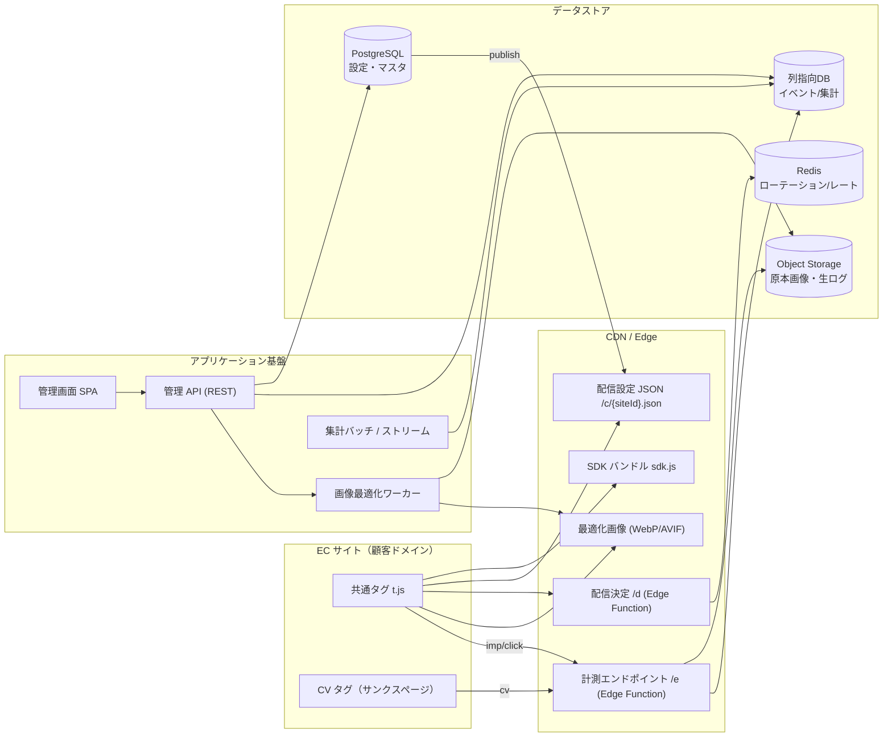
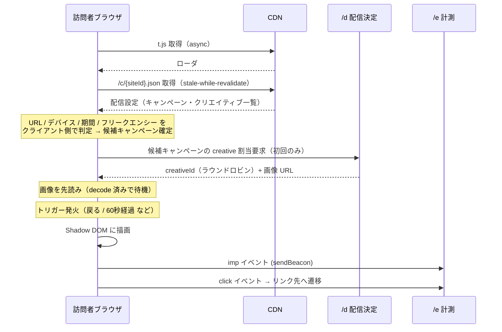
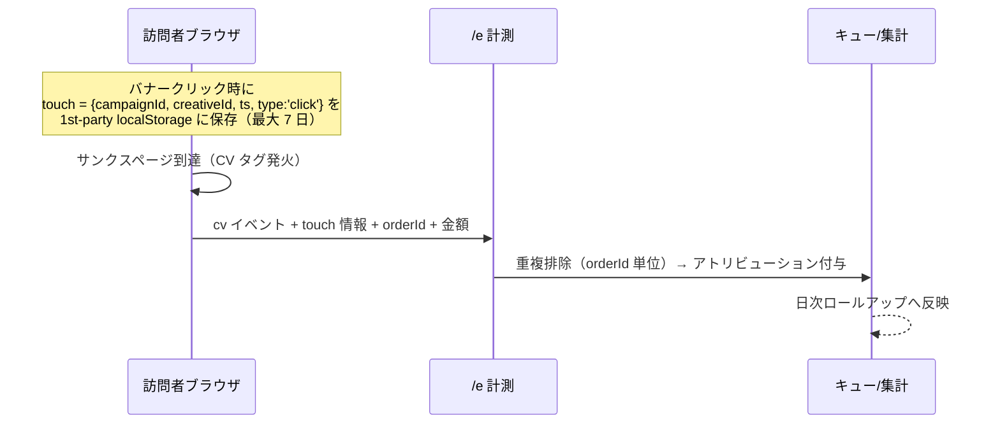

# 02. システム全体構成

## 1. コンポーネント全体像

## 2. レイヤ責務

| レイヤ | 責務 | 備考 |
| --- | --- | --- |
| ローダ (`t.js`) | サイト ID の解決、SDK の遅延ロード、コマンドキュー受付 | 極小・長期キャッシュしない (max-age=300) |
| SDK (`sdk.js`) | トリガー監視、ターゲティング判定、描画、計測送信 | immutable キャッシュ（ハッシュ付きファイル名） |
| 配信設定 (`/c/{siteId}.json`) | サイト配下の有効キャンペーン・クリエイティブ定義 | 管理画面の保存時に publish → CDN パージ |
| 配信決定 (`/d`) | 均等配信のクリエイティブ割当（Redis カウンタ） | 失敗時は SDK 側のクライアント乱択にフォールバック |
| 計測 (`/e`) | imp/click/cv の受信・正規化・エンキュー | 1x1 GIF ではなく 204 応答 |
| 管理 API | CRUD・画像処理起動・レポート取得 | 認証は Cookie セッション + CSRF |
| 集計 | 生イベント → 日次/時次ロールアップ | レポートは常にロールアップを参照 |

## 3. 技術スタック（推奨）

| 領域 | 選定 | 理由 |
| --- | --- | --- |
| SDK | TypeScript + esbuild（依存なし・IIFE） | サイズ最小化。Shadow DOM で CSS 完全隔離 |
| Edge | Cloudflare Workers（または CloudFront + Lambda@Edge） | 低レイテンシ、KV で設定配信、DDoS 耐性 |
| 管理画面 | Next.js (App Router) + TypeScript + Tailwind | プレビューを SDK レンダラと共有しやすい |
| 管理 API | Node.js (Fastify) / Next.js Route Handlers | 同一言語でレンダラ共有 |
| 設定 DB | PostgreSQL | 整合性が要るマスタ |
| イベント DB | ClickHouse（小規模なら Postgres + 日次ロールアップ） | imp が数千万/月規模になるため列指向 |
| キュー | SQS / Cloudflare Queues | 計測の書き込み平準化 |
| 画像 | Sharp + Object Storage + CDN 変換 | WebP/AVIF・2x 生成 |
| 監視 | Sentry + Datadog/CloudWatch | フロント例外も収集 |

> 規模が小さい立ち上げ期は **Postgres 一本 + 日次ロールアップ** で開始し、
> イベント量が月間 1,000 万 imp を超えた段階で ClickHouse へ移行する前提の設計にする。

## 4. 配信シーケンス

## 5. CV 計測シーケンス

## 6. 設定配信の一貫性

- 管理画面で保存 → `config_versions` に不変スナップショットを追加 → CDN(KV) へ publish → 旧版パージ
- SDK は `configVersion` を imp/click/cv に添付し、**どの設定で出た表示か**を後から追跡可能にする
- publish 失敗時は旧版がそのまま配信され続ける（fail-safe）

## 7. 障害時のふるまい（フェイルセーフ設計）

| 障害 | ふるまい |
| --- | --- |
| 設定 JSON 取得失敗 | 何も表示しない（サイトに影響を出さない） |
| `/d` 応答なし | SDK 側で重み付き乱択にフォールバック |
| `/e` 送信失敗 | localStorage にキューし次回訪問時に再送（最大 3 回 / 24 時間） |
| SDK 内で例外 | 全エントリポイントを try/catch。例外時は即 teardown し DOM を撤去 |
| 広告ブロッカー | 計測は 1st-party サブドメイン（例: `pz.顧客ドメイン`）へ CNAME 可能な構成にする |
