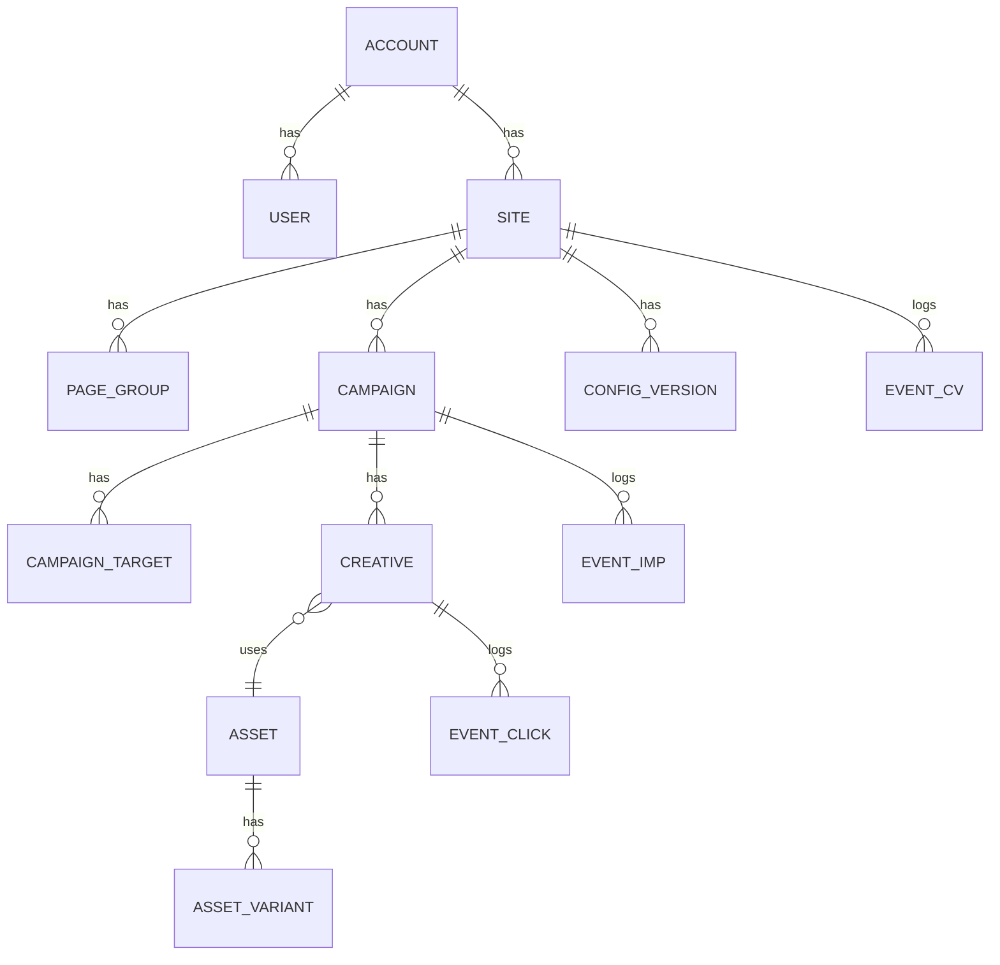

# 03. データモデル

## 1. ER 概要



## 2. マスタ（PostgreSQL）

### accounts / users

```sql
CREATE TABLE accounts (
  id           BIGSERIAL PRIMARY KEY,
  name         TEXT NOT NULL,
  created_at   TIMESTAMPTZ NOT NULL DEFAULT now()
);

CREATE TABLE users (
  id           BIGSERIAL PRIMARY KEY,
  account_id   BIGINT NOT NULL REFERENCES accounts(id),
  email        CITEXT NOT NULL UNIQUE,
  password_hash TEXT NOT NULL,
  role         TEXT NOT NULL CHECK (role IN ('owner','editor','viewer')),
  created_at   TIMESTAMPTZ NOT NULL DEFAULT now()
);
```

### sites

```sql
CREATE TABLE sites (
  id            BIGSERIAL PRIMARY KEY,
  account_id    BIGINT NOT NULL REFERENCES accounts(id),
  public_id     TEXT NOT NULL UNIQUE,        -- タグに埋め込む SITE_XXXX
  name          TEXT NOT NULL,
  allowed_hosts TEXT[] NOT NULL DEFAULT '{}',-- 配信を許可するホスト名（なりすまし防止）
  timezone      TEXT NOT NULL DEFAULT 'Asia/Tokyo',
  cv_click_window_days INT NOT NULL DEFAULT 7,
  cv_view_window_days  INT NOT NULL DEFAULT 1,
  created_at    TIMESTAMPTZ NOT NULL DEFAULT now()
);
```

### page_groups（レポートの「商品 / ページ」集計単位）

URL をそのまま集計すると `?utm_source=` 等でカーディナリティが爆発するため、
**正規化 URL** と **ページグループ**の 2 階層で持つ。

```sql
CREATE TABLE page_groups (
  id         BIGSERIAL PRIMARY KEY,
  site_id    BIGINT NOT NULL REFERENCES sites(id),
  name       TEXT NOT NULL,                -- 例: 「商品A 詳細ページ」
  product_code TEXT,                       -- 基幹/EC 側の商品コード（任意）
  match_type TEXT NOT NULL CHECK (match_type IN ('exact','prefix','contains','regex')),
  pattern    TEXT NOT NULL,
  priority   INT NOT NULL DEFAULT 100,     -- 小さいほど優先
  created_at TIMESTAMPTZ NOT NULL DEFAULT now()
);
CREATE INDEX ON page_groups (site_id, priority);
```

- タグ側で `data-product-code` / `pqz.push(['page', {productCode}])` を渡せる場合はそれを優先採用
- 渡せない場合は上記パターンマッチで分類（未分類は「その他」に集約）

### campaigns

```sql
CREATE TABLE campaigns (
  id            BIGSERIAL PRIMARY KEY,
  site_id       BIGINT NOT NULL REFERENCES sites(id),
  name          TEXT NOT NULL,
  status        TEXT NOT NULL CHECK (status IN ('draft','active','paused','archived')),
  starts_at     TIMESTAMPTZ,
  ends_at       TIMESTAMPTZ,

  -- 表示条件
  triggers      JSONB NOT NULL,   -- 下記スキーマ参照
  devices       TEXT[] NOT NULL DEFAULT '{pc,sp,tablet}',
  audience      JSONB NOT NULL DEFAULT '{}',  -- 新規/リピーター、参照元、曜日時間帯
  frequency     JSONB NOT NULL,   -- 表示回数上限・クローズ後の抑制期間
  holdout_rate  NUMERIC(4,3) NOT NULL DEFAULT 0, -- 非表示対照群の比率（効果検証用）

  -- 表示位置
  position_pc   TEXT NOT NULL CHECK (position_pc IN ('bottom_right','bottom_center','bottom_left','center')),
  position_sp   TEXT NOT NULL DEFAULT 'center' CHECK (position_sp IN ('center','bottom')),
  overlay       BOOLEAN NOT NULL DEFAULT true,   -- 背景オーバーレイの有無
  close_button  BOOLEAN NOT NULL DEFAULT true,

  priority      INT NOT NULL DEFAULT 100,        -- 同時該当時の優先度
  created_at    TIMESTAMPTZ NOT NULL DEFAULT now(),
  updated_at    TIMESTAMPTZ NOT NULL DEFAULT now()
);
```

`triggers` の JSON スキーマ:

```jsonc
{
  "mode": "any",            // any = OR / all = AND
  "rules": [
    { "type": "exit_back" },
    { "type": "dwell",       "seconds": 60 },
    { "type": "exit_intent", "sensitivity": 20 },   // 上端 20px
    { "type": "scroll",      "percent": 70 },
    { "type": "idle",        "seconds": 30 }
  ]
}
```

`frequency` の JSON スキーマ:

```jsonc
{
  "perSession": 1,
  "perDay": 2,
  "suppressDaysAfterClose": 3,
  "suppressAfterClick": true,
  "minIntervalSeconds": 300
}
```

### campaign_targets（配信対象ページ）

```sql
CREATE TABLE campaign_targets (
  id          BIGSERIAL PRIMARY KEY,
  campaign_id BIGINT NOT NULL REFERENCES campaigns(id) ON DELETE CASCADE,
  kind        TEXT NOT NULL CHECK (kind IN ('include','exclude')),
  match_type  TEXT NOT NULL CHECK (match_type IN ('exact','prefix','contains','regex')),
  pattern     TEXT NOT NULL
);
```

### assets / asset_variants（画像の自動最適化）

```sql
CREATE TABLE assets (
  id           BIGSERIAL PRIMARY KEY,
  site_id      BIGINT NOT NULL REFERENCES sites(id),
  original_key TEXT NOT NULL,        -- オブジェクトストレージのキー
  width        INT NOT NULL,
  height       INT NOT NULL,
  bytes        BIGINT NOT NULL,
  mime         TEXT NOT NULL,
  status       TEXT NOT NULL CHECK (status IN ('processing','ready','failed')),
  created_at   TIMESTAMPTZ NOT NULL DEFAULT now()
);

CREATE TABLE asset_variants (
  id        BIGSERIAL PRIMARY KEY,
  asset_id  BIGINT NOT NULL REFERENCES assets(id) ON DELETE CASCADE,
  purpose   TEXT NOT NULL,   -- 'sp' | 'pc'
  dpr       INT NOT NULL,    -- 1 | 2
  format    TEXT NOT NULL,   -- 'avif' | 'webp' | 'png'
  width     INT NOT NULL,
  height    INT NOT NULL,
  url       TEXT NOT NULL,
  bytes     BIGINT NOT NULL
);
```

### creatives

```sql
CREATE TABLE creatives (
  id          BIGSERIAL PRIMARY KEY,
  campaign_id BIGINT NOT NULL REFERENCES campaigns(id) ON DELETE CASCADE,
  name        TEXT NOT NULL,
  status      TEXT NOT NULL CHECK (status IN ('active','paused')),
  asset_pc_id BIGINT REFERENCES assets(id),
  asset_sp_id BIGINT REFERENCES assets(id),   -- 未設定なら PC 画像を自動リサイズして流用
  alt_text    TEXT NOT NULL DEFAULT '',
  link_url    TEXT NOT NULL,
  link_target TEXT NOT NULL DEFAULT '_blank' CHECK (link_target IN ('_self','_blank')),
  weight      INT NOT NULL DEFAULT 1,          -- 既定 1 = 均等配信
  created_at  TIMESTAMPTZ NOT NULL DEFAULT now()
);
```

> **均等配信**は `weight` を全て 1 にした状態のラウンドロビンで実現。
> 将来的に「勝ちパターンに寄せる」運用をしたくなった時に weight を触るだけで拡張できる。

### config_versions（CDN へ publish するスナップショット）

```sql
CREATE TABLE config_versions (
  id          BIGSERIAL PRIMARY KEY,
  site_id     BIGINT NOT NULL REFERENCES sites(id),
  version     BIGINT NOT NULL,
  payload     JSONB NOT NULL,
  published_at TIMESTAMPTZ,
  UNIQUE (site_id, version)
);
```

## 3. イベント（列指向 DB / 生ログ）

```sql
-- ClickHouse イメージ
CREATE TABLE events (
  event_time     DateTime64(3),
  site_id        UInt64,
  event_type     Enum8('imp'=1,'click'=2,'cv'=3,'close'=4,'holdout'=5),
  campaign_id    UInt64,
  creative_id    UInt64,
  config_version UInt64,
  page_group_id  UInt64,
  page_url_hash  UInt64,
  page_path      String,
  product_code   String,
  device         Enum8('pc'=1,'sp'=2,'tablet'=3),
  visitor_id     String,        -- 1st-party ID（サイト単位・クロスサイト追跡なし）
  session_id     String,
  trigger_type   LowCardinality(String),
  position       LowCardinality(String),
  -- CV 用
  order_id       String,
  revenue        Decimal64(2),
  attribution    Enum8('none'=0,'click'=1,'view'=2),
  latency_sec    UInt32,        -- 接触から CV までの秒数
  event_id       UUID           -- 冪等キー
) ENGINE = MergeTree
ORDER BY (site_id, event_time, campaign_id, creative_id);
```

- `event_id` で重複排除（ネットワーク再送・ページ再読込対策）
- CV は `site_id + order_id` でも一意制約相当の排除を行う

## 4. ロールアップ（レポート用）

レポートは常にこのテーブルを参照する（生イベントは調査用途のみ）。

```sql
CREATE TABLE stats_daily (
  date           Date,
  site_id        UInt64,
  campaign_id    UInt64,
  creative_id    UInt64,
  page_group_id  UInt64,
  device         Enum8('pc'=1,'sp'=2,'tablet'=3),
  imps           UInt64,
  clicks         UInt64,
  closes         UInt64,
  cv_click       UInt64,
  cv_view        UInt64,
  revenue        Decimal64(2),
  holdout_imps   UInt64,   -- 対照群に「出さなかった」回数
  holdout_cv     UInt64
) ENGINE = SummingMergeTree
ORDER BY (site_id, date, campaign_id, creative_id, page_group_id, device);
```

管理画面の集計軸は、このテーブルの GROUP BY だけで全て満たせる:

| 画面 | GROUP BY |
| --- | --- |
| 期間サマリ | date |
| ページ（商品）別 | page_group_id |
| クリエイティブ別 | creative_id |
| デバイス別 | device |
| キャンペーン別 | campaign_id |

## 5. 保持ポリシー

| データ | 保持期間 |
| --- | --- |
| 生イベント (events) | 13 ヶ月 |
| ロールアップ (stats_daily) | 無期限 |
| 生ログ (Object Storage) | 90 日 |
| visitor_id | 最終アクセスから 13 ヶ月で削除 |
