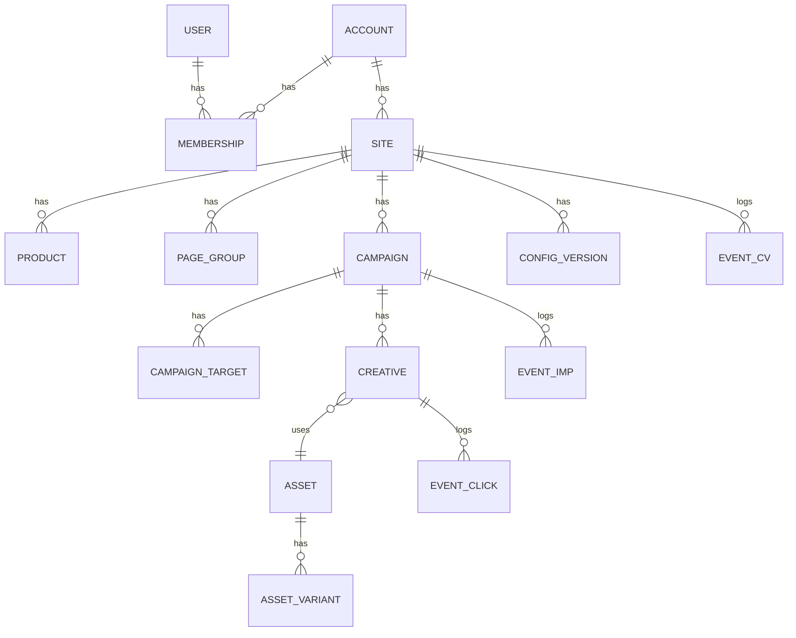

# 03. データモデル

> **DB は PostgreSQL 一本**（月間 1 万 PV 規模のため）。
> マスタ・イベント・集計をすべて同一 DB に置き、月間 100 万 PV まではこの構成で運用します。
> スケール時の移行方針は `02-architecture.md` 9 章。
> テナント分離（RLS）は `10-multitenancy.md`。

## 1. ER 概要



## 2. マスタ（PostgreSQL）

### accounts / users

```sql
CREATE TABLE accounts (
  id           BIGSERIAL PRIMARY KEY,
  name         TEXT NOT NULL,
  created_at   TIMESTAMPTZ NOT NULL DEFAULT now()
);

CREATE TABLE accounts_plan (
  account_id   BIGINT PRIMARY KEY REFERENCES accounts(id),
  plan_code    TEXT NOT NULL REFERENCES plans(code),
  status       TEXT NOT NULL CHECK (status IN ('trial','active','past_due','canceled')),
  trial_ends_at TIMESTAMPTZ
);

-- User は複数アカウントに所属できる（代理店運用に対応）
CREATE TABLE users (
  id            BIGSERIAL PRIMARY KEY,
  email         CITEXT NOT NULL UNIQUE,
  password_hash TEXT,
  created_at    TIMESTAMPTZ NOT NULL DEFAULT now()
);

CREATE TABLE memberships (
  id         BIGSERIAL PRIMARY KEY,
  account_id BIGINT NOT NULL REFERENCES accounts(id) ON DELETE CASCADE,
  user_id    BIGINT NOT NULL REFERENCES users(id) ON DELETE CASCADE,
  role       TEXT NOT NULL CHECK (role IN ('owner','editor','viewer')),
  accepted_at TIMESTAMPTZ,
  UNIQUE (account_id, user_id)
);
```

### sites

```sql
CREATE TABLE sites (
  id            BIGSERIAL PRIMARY KEY,
  account_id    BIGINT NOT NULL REFERENCES accounts(id),
  public_id     TEXT NOT NULL UNIQUE,        -- タグに埋め込む SITE_XXXX（26桁ランダム）
  name          TEXT NOT NULL,
  allowed_hosts TEXT[] NOT NULL DEFAULT '{}',-- 配信/計測を許可するホスト名（なりすまし防止）
  cart_hosts    TEXT[] NOT NULL DEFAULT '{}',-- スマレジ・リピート側のホスト名
  cross_domain_cart BOOLEAN NOT NULL DEFAULT false, -- 別ドメインならビュースルーCV列を隠す
  signing_key   BYTEA NOT NULL,              -- pz_t 署名用（サーバのみ保持）
  timezone      TEXT NOT NULL DEFAULT 'Asia/Tokyo',
  cv_click_window_days INT NOT NULL DEFAULT 7,
  cv_view_window_days  INT NOT NULL DEFAULT 1,
  cv_count_recurring   BOOLEAN NOT NULL DEFAULT false, -- 定期の継続注文をCVに含めるか
  created_at    TIMESTAMPTZ NOT NULL DEFAULT now()
);
```

### products（レポートの主集計軸）

商品コードはタグから確実に受け取れるため、**URL パターンによる分類は不要**。
初めて受信した商品コードは自動で upsert し、名称は管理画面で編集できる。

```sql
CREATE TABLE products (
  id           BIGSERIAL PRIMARY KEY,
  site_id      BIGINT NOT NULL REFERENCES sites(id) ON DELETE CASCADE,
  product_code TEXT NOT NULL,               -- カート側の商品コード
  name         TEXT NOT NULL DEFAULT '',    -- タグ受信値 or 管理画面で編集
  archived     BOOLEAN NOT NULL DEFAULT false,
  first_seen_at TIMESTAMPTZ NOT NULL DEFAULT now(),
  last_seen_at  TIMESTAMPTZ NOT NULL DEFAULT now(),
  UNIQUE (site_id, product_code)
);
```

### page_groups（商品ページ以外の補助的な集計単位）

LP・記事ページなど商品コードを持たないページを分類するために残す。

```sql
CREATE TABLE page_groups (
  id         BIGSERIAL PRIMARY KEY,
  site_id    BIGINT NOT NULL REFERENCES sites(id) ON DELETE CASCADE,
  name       TEXT NOT NULL,                -- 例: 「定期LP（A案）」
  match_type TEXT NOT NULL CHECK (match_type IN ('exact','prefix','contains','regex')),
  pattern    TEXT NOT NULL,
  priority   INT NOT NULL DEFAULT 100,     -- 小さいほど優先
  created_at TIMESTAMPTZ NOT NULL DEFAULT now()
);
CREATE INDEX ON page_groups (site_id, priority);
```

分類の優先順位: `productCode` があればそれを採用 → なければ page_group にマッチ →
どちらも無ければ「その他」に集約。

### campaigns

```sql
CREATE TABLE campaigns (
  id            BIGSERIAL PRIMARY KEY,
  site_id       BIGINT NOT NULL REFERENCES sites(id),
  name          TEXT NOT NULL,
  status        TEXT NOT NULL CHECK (status IN ('draft','active','paused','archived')),
  starts_at     TIMESTAMPTZ,
  ends_at       TIMESTAMPTZ,

  -- 表示条件
  triggers      JSONB NOT NULL,   -- 下記スキーマ参照
  devices       TEXT[] NOT NULL DEFAULT '{pc,sp,tablet}',
  audience      JSONB NOT NULL DEFAULT '{}',  -- 新規/リピーター、参照元、曜日時間帯
  frequency     JSONB NOT NULL,   -- 表示回数上限・クローズ後の抑制期間
  holdout_rate  NUMERIC(4,3) NOT NULL DEFAULT 0, -- 非表示対照群の比率（効果検証用）

  -- 表示位置
  position_pc   TEXT NOT NULL CHECK (position_pc IN ('bottom_right','bottom_center','bottom_left','center')),
  position_sp   TEXT NOT NULL DEFAULT 'center' CHECK (position_sp IN ('center','bottom')),
  overlay       BOOLEAN NOT NULL DEFAULT true,   -- 背景オーバーレイの有無
  close_button  BOOLEAN NOT NULL DEFAULT true,

  priority      INT NOT NULL DEFAULT 100,        -- 同時該当時の優先度
  created_at    TIMESTAMPTZ NOT NULL DEFAULT now(),
  updated_at    TIMESTAMPTZ NOT NULL DEFAULT now()
);
```

`triggers` の JSON スキーマ:

```jsonc
{
  "mode": "any",            // any = OR / all = AND
  "rules": [
    { "type": "exit_back" },
    { "type": "dwell",       "seconds": 60 },
    { "type": "exit_intent", "sensitivity": 20 },   // 上端 20px
    { "type": "scroll",      "percent": 70 },
    { "type": "idle",        "seconds": 30 }
  ]
}
```

`frequency` の JSON スキーマ:

```jsonc
{
  "perSession": 1,
  "perDay": 2,
  "suppressDaysAfterClose": 3,
  "suppressAfterClick": true,
  "minIntervalSeconds": 300
}
```

### campaign_targets（配信対象ページ）

商品コード指定と URL ルール指定の両方に対応する。

```sql
CREATE TABLE campaign_targets (
  id          BIGSERIAL PRIMARY KEY,
  campaign_id BIGINT NOT NULL REFERENCES campaigns(id) ON DELETE CASCADE,
  kind        TEXT NOT NULL CHECK (kind IN ('include','exclude')),
  target_type TEXT NOT NULL CHECK (target_type IN ('product_code','url')),
  match_type  TEXT CHECK (match_type IN ('exact','prefix','contains','regex')), -- url のみ
  pattern     TEXT NOT NULL   -- product_code のときは商品コードそのもの
);
```

判定順序: `exclude` に 1 つでもマッチしたら配信しない → `include` が空なら全ページ対象、
1 件以上あればいずれかにマッチした場合のみ配信。

### assets / asset_variants（画像の自動最適化）

```sql
CREATE TABLE assets (
  id           BIGSERIAL PRIMARY KEY,
  site_id      BIGINT NOT NULL REFERENCES sites(id),
  original_key TEXT NOT NULL,        -- オブジェクトストレージのキー
  width        INT NOT NULL,
  height       INT NOT NULL,
  bytes        BIGINT NOT NULL,
  mime         TEXT NOT NULL,
  status       TEXT NOT NULL CHECK (status IN ('processing','ready','failed')),
  created_at   TIMESTAMPTZ NOT NULL DEFAULT now()
);

CREATE TABLE asset_variants (
  id        BIGSERIAL PRIMARY KEY,
  asset_id  BIGINT NOT NULL REFERENCES assets(id) ON DELETE CASCADE,
  purpose   TEXT NOT NULL,   -- 'sp' | 'pc'
  dpr       INT NOT NULL,    -- 1 | 2
  format    TEXT NOT NULL,   -- 'avif' | 'webp' | 'png'
  width     INT NOT NULL,
  height    INT NOT NULL,
  url       TEXT NOT NULL,
  bytes     BIGINT NOT NULL
);
```

### creatives

```sql
CREATE TABLE creatives (
  id          BIGSERIAL PRIMARY KEY,
  campaign_id BIGINT NOT NULL REFERENCES campaigns(id) ON DELETE CASCADE,
  name        TEXT NOT NULL,
  status      TEXT NOT NULL CHECK (status IN ('active','paused')),
  asset_pc_id BIGINT REFERENCES assets(id),
  asset_sp_id BIGINT REFERENCES assets(id),   -- 未設定なら PC 画像を自動リサイズして流用
  alt_text    TEXT NOT NULL DEFAULT '',
  link_url    TEXT NOT NULL,
  link_target TEXT NOT NULL DEFAULT '_blank' CHECK (link_target IN ('_self','_blank')),
  weight      INT NOT NULL DEFAULT 1,          -- 既定 1 = 均等配信
  created_at  TIMESTAMPTZ NOT NULL DEFAULT now()
);
```

> **均等配信**は `weight` を全て 1 にした状態のラウンドロビンで実現。
> 将来的に「勝ちパターンに寄せる」運用をしたくなった時に weight を触るだけで拡張できる。

### config_versions（CDN へ publish するスナップショット）

```sql
CREATE TABLE config_versions (
  id          BIGSERIAL PRIMARY KEY,
  site_id     BIGINT NOT NULL REFERENCES sites(id),
  version     BIGINT NOT NULL,
  payload     JSONB NOT NULL,
  published_at TIMESTAMPTZ,
  UNIQUE (site_id, version)
);
```

## 3. イベント（PostgreSQL）

月間 2,000 件程度のため、専用の分析 DB は使わず PostgreSQL に格納する。
将来の移行を容易にするため、初めから月次パーティションで作成しておく。

```sql
CREATE TABLE events (
  id             BIGSERIAL,
  event_id       UUID NOT NULL,            -- 冪等キー（クライアント生成）
  occurred_at    TIMESTAMPTZ NOT NULL,
  received_at    TIMESTAMPTZ NOT NULL DEFAULT now(),
  account_id     BIGINT NOT NULL,
  site_id        BIGINT NOT NULL,
  event_type     TEXT NOT NULL CHECK (event_type IN ('imp','click','cv','close','holdout')),
  campaign_id    BIGINT,
  creative_id    BIGINT,
  config_version BIGINT,
  product_id     BIGINT,                   -- products.id
  page_group_id  BIGINT,
  page_path      TEXT,
  device         TEXT CHECK (device IN ('pc','sp','tablet')),
  visitor_id     TEXT,                     -- 1st-party ID（サイト単位・クロスサイト追跡なし）
  session_id     TEXT,
  trigger_type   TEXT,
  position       TEXT,
  -- CV 用
  order_id       TEXT,
  order_type     TEXT CHECK (order_type IN ('first','recurring')),
  plan_type      TEXT CHECK (plan_type IN ('subscription','onetime')),
  revenue        NUMERIC(12,2),
  attribution    TEXT CHECK (attribution IN ('none','click','view')),
  latency_sec    INT,                      -- 接触から CV までの秒数
  is_bot         BOOLEAN NOT NULL DEFAULT false,
  PRIMARY KEY (id, occurred_at)
) PARTITION BY RANGE (occurred_at);

CREATE UNIQUE INDEX ON events (event_id, occurred_at);
CREATE UNIQUE INDEX events_cv_order ON events (site_id, order_id)
  WHERE event_type = 'cv' AND order_id IS NOT NULL;
CREATE INDEX ON events (site_id, occurred_at DESC);
```

- `event_id` で重複排除（ネットワーク再送・ページ再読込対策）
- CV は部分ユニークインデックスで `site_id + order_id` の重複を**DB レベルで**排除
- パーティションは月次。13 ヶ月経過したパーティションを `DROP` して保持期限を実装

## 4. ロールアップ（レポート用）

レポートは常にこのテーブルを参照する（生イベントを直接クエリするコードは書かない。
将来イベントストアを差し替えた際にレポート側を修正せずに済むため）。

```sql
CREATE TABLE stats_daily (
  date           DATE NOT NULL,
  account_id     BIGINT NOT NULL,
  site_id        BIGINT NOT NULL,
  campaign_id    BIGINT NOT NULL DEFAULT 0,
  creative_id    BIGINT NOT NULL DEFAULT 0,
  product_id     BIGINT NOT NULL DEFAULT 0,
  page_group_id  BIGINT NOT NULL DEFAULT 0,
  device         TEXT NOT NULL,
  imps           BIGINT NOT NULL DEFAULT 0,
  clicks         BIGINT NOT NULL DEFAULT 0,
  closes         BIGINT NOT NULL DEFAULT 0,
  cv_click       BIGINT NOT NULL DEFAULT 0,
  cv_view        BIGINT NOT NULL DEFAULT 0,
  revenue        NUMERIC(14,2) NOT NULL DEFAULT 0,
  holdout_sessions BIGINT NOT NULL DEFAULT 0,  -- 対照群として「出さなかった」回数
  holdout_cv     BIGINT NOT NULL DEFAULT 0,
  PRIMARY KEY (site_id, date, campaign_id, creative_id, product_id, page_group_id, device)
);
```

管理画面の集計軸は、このテーブルの GROUP BY だけで全て満たせる:

| 画面 | GROUP BY |
| --- | --- |
| 期間サマリ | date |
| 商品別 | product_id |
| ページ別（商品以外） | page_group_id |
| クリエイティブ別 | creative_id |
| デバイス別 | device |
| キャンペーン別 | campaign_id |

集計は日次 Cron で `events` から `INSERT ... ON CONFLICT DO UPDATE`。
CV は最大 7 日遅れて到着するため、**毎回過去 8 日分を再集計**する。

## 5. 保持ポリシー

| データ | 保持期間 |
| --- | --- |
| 生イベント (events) | 13 ヶ月 |
| ロールアップ (stats_daily) | 無期限 |
| 生ログ (Object Storage) | 90 日 |
| visitor_id | 最終アクセスから 13 ヶ月で削除 |
