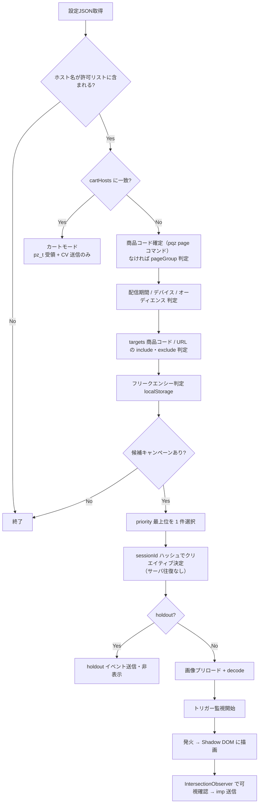

# 05. 設置タグ / SDK 設計

## 1. 設置タグ

### 1.1 共通タグ（全ページの `</head>` 直前に 1 行）

```html
<script async src="https://cdn.popup.example.com/t.js?sid=SITE_XXXX"></script>
```

- `async` のため、EC サイトのレンダリングをブロックしない
- ローダは gzip 約 3KB。役割は「コマンドキュー確保」と「SDK 本体の遅延ロード」のみ
- SDK 本体は `requestIdleCallback`（未対応環境は `setTimeout(0)`）でロード

### 1.2 コンバージョンタグ（サンクスページのみ）

```html
<script>
  window.pqz = window.pqz || [];
  pqz.push(['conversion', {
    orderId : '{{注文番号}}',
    value   : {{税抜商品金額}},
    currency: 'JPY'
  }]);
</script>
```

- 共通タグより**前**に置いても動作する（コマンドキュー方式）
- `orderId` は重複計測防止に必須。同一 `orderId` は 1 CV として扱う

### 1.3 商品コードタグ（商品ページ・必須）

商品コードはタグから渡せることが確定しているため、**これを必須の設置項目**とします。

```html
<script>
  window.pqz = window.pqz || [];
  pqz.push(['page', {
    productCode: '{{商品コード}}',
    productName: '{{商品名}}',
    pageType   : 'product'
  }]);
</script>
```

- レポートの商品別集計、キャンペーンの商品指定ターゲティングの両方でこの値を使う
- 初めて受信した商品コードは自動で商品マスタに登録される（手動メンテ不要）
- URL ルールで商品を推測する必要がなくなり、設定ミス起因の集計ズレが構造的に消える

### 1.4 SDK の動作モード

同じ共通タグを設置しても、ホスト名に応じて動作を変えます。

| モード | 適用ホスト | 動作 |
| --- | --- | --- |
| `full` | 顧客サイト（LP・商品ページ） | トリガー監視・描画・計測すべて |
| `cart` | `site.cartHosts` に一致（スマレジ・リピート側） | `pz_t` 受け取り + CV 送信のみ。**描画しない・`pushState` しない** |

カートモードではポップアップを一切表示せず、購入フォームの挙動にも干渉しません。

## 2. SDK 構成

```
packages/
  loader/        t.js        … 3KB。コマンドキュー + SDK ロード
  sdk/           sdk.js      … 12KB 目標。トリガー・判定・計測
  renderer/      renderer.ts … ★ SDK と管理画面プレビューで共有する描画モジュール
  shared/        types.ts    … 設定 JSON の型定義（API と共有）
```

**`renderer` を共有パッケージにすることが設計上の要**。
管理画面のプレビューが「実物と同じコード」で描画されるため、
「プレビューでは崩れていないのに本番で崩れる」事故が構造的に起きない。

```
renderer.render(container, {
  creative, position, device, overlay, closeButton, preview: true|false
})
```

## 3. トリガー実装方式

### 3.1 ブラウザバック検知（`exit_back`）

`beforeunload` では表示できず、`popstate` 単体では他サイトからの戻りと区別できないため、
**history に 1 段ダミー状態を積む**方式を採る。

```ts
// 初期化時
history.pushState({ __pz: 1 }, '', location.href);

window.addEventListener('popstate', (e) => {
  if (fired) return;
  // ダミーを消費した = ユーザーが「戻る」を押した
  history.pushState({ __pz: 1 }, '', location.href); // 再度積み直す（連打対策）
  trigger('exit_back');
});
```

考慮点:

| 論点 | 対応 |
| --- | --- |
| SPA サイトのルーティングを壊さないか | `state.__pz` を見て自前の state のみ処理。他 state は素通し |
| URL が変わらないか | `pushState(…, location.href)` で URL は不変 |
| 戻るが効かなくなる（バックボタントラップ） | **1 回だけ**トラップし、ポップアップ表示後は積み直さない。× を押すか 1 回目のトリガー後は通常の戻る動作を許可する（ダークパターン回避 / ブラウザのペナルティ回避） |
| SPA サイトで pushState が競合 | 設定に `disableBackTrigger` を用意し、SPA サイトでは無効化できるようにする |
| カートページで購入フォームを壊す | **カートモードでは `pushState` を一切行わない**（強制無効） |
| iOS Safari のスワイプバック | 同様に popstate が発火するため動作する |

### 3.2 滞在時間（`dwell`）

- **「サイト訪問から」** の計測なので、ページ単位の経過時間ではなく
  `sessionStorage` に保存した `sessionStartedAt` からの経過秒で判定
- タブが非アクティブの時間は除外する（`visibilitychange` で加算を停止 = 実滞在時間）
- 判定は 1 秒ごとの `setInterval` ではなく、残り時間ぶんの `setTimeout` 1 本

### 3.3 離脱意図（`exit_intent` / PC のみ）

```ts
document.addEventListener('mouseout', (e) => {
  if (e.relatedTarget === null && e.clientY <= sensitivity) trigger('exit_intent');
});
```

- 初期表示直後の誤爆を避けるため、ページ読み込みから 3 秒間は無効
- SP では発火させない（マウスイベントが無い / 誤爆する）

### 3.4 その他

| トリガー | 実装 |
| --- | --- |
| `scroll` | `IntersectionObserver` でセンチネル要素を監視（scroll イベント多発を避ける） |
| `idle` | `pointermove` / `keydown` / `scroll` をデバウンスして無操作タイマ再起動 |
| `exit_tab` | `visibilitychange` が `hidden` → 復帰時に表示 |

## 4. 表示判定パイプライン



商品コードタグ (`pqz.push(['page', ...])`) は共通タグより後に実行される場合があるため、
**商品コードの受領を最大 500ms 待ってから判定を開始**します
（`pageType: 'product'` のページで商品コードが未着のまま判定すると取りこぼすため）。
待機中もトリガー監視は開始しておき、判定完了前に発火した場合は判定後に描画します。

**画像はトリガー発火前にプリロードして `img.decode()` まで済ませておく**。
これにより発火から描画まで 100ms 以内、かつ「一瞬白いまま出る」を防ぐ。

## 5. 描画（表示位置とレスポンシブ）

### 5.1 隔離

- ルートは `document.body` 直下に `<div id="pz-root">` を作り **Shadow DOM (closed)** を張る
- サイト側 CSS の影響を受けず、こちらの CSS も漏れない
- `z-index: 2147483000`、`position: fixed`

### 5.2 表示位置のスタイル定義

| デバイス | 位置 | CSS |
| --- | --- | --- |
| SP | `center` | `inset:0; display:grid; place-items:center;` バナー幅 `min(86vw, 420px)` |
| SP | `bottom`（拡張） | `left:0; right:0; bottom:0; padding-bottom: env(safe-area-inset-bottom);` |
| PC | `bottom_right` | `right:24px; bottom:24px;` |
| PC | `bottom_center` | `left:50%; bottom:24px; transform:translateX(-50%);` |
| PC | `bottom_left` | `left:24px; bottom:24px;` |
| PC | `center` | `inset:0; display:grid; place-items:center;` |

- **オーバーレイ（背景暗転）は `center` のときのみ既定 ON**。隅表示で暗転すると購買動線を阻害するため
- バナー本体は `max-width` を position ごとに設定（隅: 380px / 中央: 560px）、
  `img { width:100%; height:auto; display:block; }` で **CLS を発生させない**
- アニメーション: `center` はフェード + 微スケール、隅はスライドイン（200ms / `prefers-reduced-motion` 尊重）

### 5.3 アクセシビリティ

- `role="dialog"` `aria-modal="true"`（center 時）/ `aria-label` にクリエイティブ名
- ESC で閉じる、フォーカストラップ（center 時のみ）、閉じたら元のフォーカスへ復帰
- × ボタンは最小 44×44px のタップ領域

## 6. ストレージ設計（1st-party のみ）

| キー | 内容 | 保持 |
| --- | --- | --- |
| `pz.vid` | visitorId（UUID v4） | localStorage / 13 ヶ月 |
| `pz.ses` | sessionId + sessionStartedAt | sessionStorage（30 分無操作で更新） |
| `pz.fq.{campaignId}` | 表示回数・最終表示時刻・クローズ日時 | localStorage |
| `pz.touch` | 直近の接触（click / view）配列 | localStorage / 最大 7 日・10 件 |
| `pz.q` | 送信失敗イベントの再送キュー | localStorage / 最大 24 時間 |

> **オリジンごとに分離される点に注意**。顧客ドメインで保存した `pz.touch` は
> カートドメインからは読めません。そのためクリック時にリンク先 URL へ `pz_t` を付与し、
> カート側 SDK が受け取って**カートオリジンの localStorage に保存し直します**
> （`09-cart-integration.md` 2 章）。

- クロスサイトトラッキングは行わない（3rd-party Cookie 不使用）
- ITP により localStorage が 7 日で消える環境があるため、CV ウィンドウの実効値は 7 日が上限。
  厳密な計測が必要な場合は S2S CV API を併用

## 7. 同意管理（CMP）連携

```html
<script>pqz.push(['consent', { analytics: true, marketing: false }]);</script>
```

- `consent.analytics` が false の場合、`visitorId` を発行せず**セッション限定 ID** で計測（個人単位追跡なし）
- サイト側が CMP 未導入なら既定 ON（日本国内向け）。設定でオプトイン必須にも切替可能

## 8. パフォーマンス予算

| 項目 | 予算 |
| --- | --- |
| `t.js` | gzip 4KB 以下 |
| `sdk.js` | gzip 15KB 以下 |
| メインスレッド占有 | 初期化 20ms 以下 |
| ネットワーク（表示なし時） | 2 リクエスト（t.js, config） |
| CLS への寄与 | 0（fixed レイヤのみ） |
| LCP への寄与 | 0（LCP 確定後にロード） |
