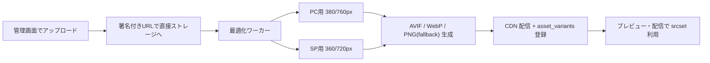

# 06. 管理画面設計

## 1. 画面構成

```
ログイン
└ サイト選択
   ├ ダッシュボード          … 期間サマリ / 日次推移 / 上位クリエイティブ
   ├ キャンペーン一覧
   │   └ キャンペーン編集    … ①基本 ②対象ページ ③表示条件 ④表示位置 ⑤クリエイティブ
   │        └ プレビュー     … SP / PC 切替
   ├ クリエイティブ一覧      … 横断で実績比較
   ├ レポート
   │   ├ 期間サマリ
   │   ├ ページ（商品）別
   │   ├ クリエイティブ別
   │   └ CSV エクスポート
   ├ ページグループ設定      … URL ルール ⇔ 商品コードの対応表
   └ 設定
       ├ タグ発行            … 共通タグ / CV タグのコピー、設置チェッカー
       ├ メンバー・権限
       └ サイト設定          … 許可ホスト、CV ウィンドウ、タイムゾーン
```

## 2. キャンペーン編集（5 ステップ）

### ① 基本
キャンペーン名 / ステータス（下書き・配信中・停止）/ 配信期間 / 優先度 / 対照群比率

### ② 対象ページ
- 配信する URL ルール（追加式）: 完全一致・前方一致・含む・正規表現
- 除外 URL ルール
- 右ペインに「テスト URL を入力 → マッチ判定」ツールを常設（設定ミスを即座に検知）

### ③ 表示条件
- トリガー（チェックボックス + パラメータ）
  - ☑ ブラウザバック時
  - ☑ 訪問から `[60]` 秒経過
  - ☐ マウスが画面外へ（PC のみ）
  - ☐ `[70]`% スクロール時
  - ☐ `[30]` 秒間無操作
  - 判定方式: いずれか満たす / すべて満たす
- デバイス: PC / SP / タブレット
- 訪問者: すべて / 新規のみ / リピーターのみ
- 曜日・時間帯
- フリークエンシー: セッション内 `[1]` 回 / 1 日 `[2]` 回 / 閉じたら `[3]` 日間非表示 / クリック後は非表示

### ④ 表示位置

```
PC:  ○ 右下   ○ 下部中央   ○ 左下   ○ 画面中央
SP:  ● 画面中央（固定）
     ☑ 背景を暗くする   ☑ ×ボタンを表示
```

選択に応じて右ペインのプレビューが即時反映される。

### ⑤ クリエイティブ

一覧（ドラッグ並び替え）+ 追加モーダル:

| 項目 | 内容 |
| --- | --- |
| クリエイティブ名 | 管理用 |
| 画像（PC） | ドラッグ&ドロップ。推奨 760×600px 以上（2x 前提） |
| 画像（SP） | 未設定なら PC 画像を自動最適化して流用 |
| 代替テキスト | 画像非表示時・読み上げ用 |
| リンク先 URL | https のみ。プロトコル欠落は自動補完し警告 |
| 開き方 | 同じタブ / 新しいタブ |
| 配信比率 | 既定「均等」。トグルで手動比率に切替可能 |
| ステータス | 配信中 / 停止 |

**均等配信の表示**: 有効 3 件なら「各 33.3%」とバッジ表示し、
停止すると即座に「各 50%」へ再計算されることを UI で明示する。

## 3. 画像の自動最適化

### 3.1 パイプライン



- 原本は 10MB / 4000px まで。長辺基準でアスペクト比を維持してリサイズ
- 出力形式は AVIF → WebP → PNG/JPEG のフォールバック順（`<picture>` 相当を JS で構築）
- 透過の有無を判定し、非透過なら JPEG フォールバック（サイズ削減）
- 100KB を超える出力は品質を段階的に下げて再エンコード（目標 60KB 以下）

### 3.2 バリデーションと警告

| 検査 | 挙動 |
| --- | --- |
| 解像度が推奨未満 | 「PC 表示でぼやける可能性」警告（保存は可能） |
| アスペクト比が極端（縦長 1:3 超など） | SP 中央表示で画面をはみ出す旨を警告 |
| ファイルサイズ過大 | 自動圧縮後の推定サイズを表示 |
| 文字が小さい | （将来）OCR で最小文字高を推定し警告 |

## 4. プレビュー

- **配信 SDK と同一の `renderer` パッケージ**を使い、iframe 内で描画
- デバイスフレーム
  - SP: 375×667（iPhone SE）/ 390×844（iPhone 15）切替
  - PC: 1440×900 / 1280×800 切替
- ダミーの EC ページ背景（もしくは対象 URL のスクリーンショット）の上に重ねて表示
- 表示位置・オーバーレイ・×ボタン・アニメーションまで本番同等
- クリエイティブが複数ある場合は「◀ 1/3 ▶」で切り替えて全パターン確認
- 「実サイトでテスト表示」ボタン → 対象 URL に `?pz_preview={token}` を付与したリンクを発行。
  そのパラメータが付いた時のみ、トリガー・フリークエンシーを無視して即時表示し、**計測は送らない**

## 5. レポート画面

### 5.1 共通フィルタ（画面上部に固定）

```
[期間: 2026/08/01 - 2026/08/11 ▾] [キャンペーン: すべて ▾]
[ページグループ: すべて ▾] [デバイス: すべて ▾]   [CSV出力]
```

期間プリセット: 今日 / 昨日 / 過去 7 日 / 過去 30 日 / 今月 / 先月 / カスタム
比較機能: 「前期間と比較」トグル（増減率を併記）

### 5.2 サマリカード

```
 表示回数        クリック数      CTR         CV 数        CVR         売上
 128,400        5,136          4.00%       412          8.02%       ¥3,820,000
 ▲12.4%         ▲8.1%          ▼0.2pt      ▲15.0%       ▲6.4%       ▲18.2%
```

### 5.3 ページ（商品）別テーブル

| ページグループ | 商品コード | imp | click | CTR | CV | CVR | 売上 |
| --- | --- | ---: | ---: | ---: | ---: | ---: | ---: |
| 商品A 詳細 | 1001 | 42,100 | 2,105 | 5.00% | 189 | 8.98% | ¥1,620,000 |
| 商品B 詳細 | 1002 | 31,800 | 1,272 | 4.00% | 96 | 7.55% | ¥810,000 |
| カート | — | 18,200 | 910 | 5.00% | 84 | 9.23% | ¥760,000 |

- 行クリックで、そのページに絞り込んだクリエイティブ別内訳へドリルダウン

### 5.4 クリエイティブ別テーブル

| サムネ | クリエイティブ | 配信比率 | imp | click | CTR | CV（click / view） | CVR | 売上 |
| --- | --- | ---: | ---: | ---: | ---: | ---: | ---: | ---: |
| 🖼 | クーポンA | 33.3% | 42,800 | 1,926 | 4.50% | 156（142/14） | 8.10% | ¥1,340,000 |
| 🖼 | LINE誘導B | 33.3% | 42,900 | 1,502 | 3.50% | 121（110/11） | 8.06% | ¥1,020,000 |

- サムネイルにホバーで拡大プレビュー
- imp がほぼ同数であることが「均等配信が正しく効いている」ことの検証にもなる

### 5.5 効果検証（対照群）

`holdoutRate > 0` のキャンペーンでのみ表示。

```
        表示あり群         非表示群（対照）      差分
CVR     8.02%             6.41%                 +1.61pt
推定増分CV   +82件 / 期間
```

「ポップアップによって本当に CV が増えたのか」は、
クリック経由 CV の集計だけでは答えられない（元々買う人がクリックしただけの可能性）。
対照群を最初から設計に入れておくことで、この問いに答えられる。

## 6. タグ設置チェッカー

設定 > タグ発行 に配置。

1. 対象 URL を入力 → サーバ側で HTML を取得し、共通タグ / CV タグの有無を検査
2. 直近 24 時間のイベント受信状況を表示（「共通タグ: 受信あり / CV タグ: 未受信」）
3. よくある設置ミスを診断
   - CV タグはあるが `orderId` が空 → 重複計測の警告
   - 許可ホストに未登録のドメインからイベントが来ている → 追加を促す

## 7. 権限

| 権限 | owner | editor | viewer |
| --- | --- | --- | --- |
| レポート閲覧 | ✓ | ✓ | ✓ |
| キャンペーン / クリエイティブ編集 | ✓ | ✓ | |
| 配信の開始・停止 | ✓ | ✓ | |
| サイト設定・メンバー管理 | ✓ | | |
