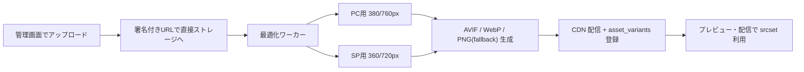

# 06. 管理画面設計

## 1. 画面構成

```
ログイン
└ アカウント選択（所属が複数ある場合）
 └ サイト選択
   ├ ダッシュボード          … 期間サマリ / 日次推移 / 上位クリエイティブ
   ├ キャンペーン一覧
   │   └ キャンペーン編集    … ①基本 ②対象ページ ③表示条件 ④表示位置 ⑤クリエイティブ
   │        └ プレビュー     … SP / PC 切替
   ├ クリエイティブ一覧      … 横断で実績比較
   ├ レポート
   │   ├ 期間サマリ
   │   ├ 商品別（productCode）
   │   ├ ページ別（商品コードなしのページ）
   │   ├ クリエイティブ別
   │   └ CSV エクスポート
   ├ 商品マスタ              … 自動登録された商品コード一覧・名称編集
   ├ ページグループ設定      … LP・記事等の URL ルール
   └ 設定
       ├ タグ発行            … 共通タグ / 商品コードタグ / CV タグ、設置チェッカー
       ├ メンバー・権限      … アカウント単位の招待・権限
       ├ プラン・利用状況    … imp クォータ、請求
       └ サイト設定          … 許可ホスト、カートドメイン、CV ウィンドウ、CV 定義
```

## 2. キャンペーン編集（5 ステップ）

### ① 基本
キャンペーン名 / ステータス（下書き・配信中・停止）/ 配信期間 / 優先度 / 対照群比率

### ② 対象ページ

**商品コード指定を第一候補**にする（URL の手打ちが不要になり、設定ミスが構造的に減る）。

```
対象商品   [ 定期コースA ×] [ お試しセット ×]  ＋商品を追加 ▾
           └ 受信済みの商品コードからサジェスト選択

対象URL    （商品コード以外のページに出す場合のみ）
           前方一致  /lp/                        ＋ルールを追加
除外URL    含む      /cart                       ＋ルールを追加
```

- 右ペインに「テスト URL / 商品コードを入力 → マッチ判定」ツールを常設
- 何も指定しない場合は全ページ配信（ただしカートドメインは既定で除外）

### ③ 表示条件
- トリガー（チェックボックス + パラメータ）
  - ☑ ブラウザバック時
  - ☑ 訪問から `[60]` 秒経過
  - ☐ マウスが画面外へ（PC のみ）
  - ☐ `[70]`% スクロール時
  - ☐ `[30]` 秒間無操作
  - 判定方式: いずれか満たす / すべて満たす
- デバイス: PC / SP / タブレット
- 訪問者: すべて / 新規のみ / リピーターのみ
- 曜日・時間帯
- フリークエンシー: セッション内 `[1]` 回 / 1 日 `[2]` 回 / 閉じたら `[3]` 日間非表示 / クリック後は非表示

### ④ 表示位置

```
PC:  ○ 右下   ○ 下部中央   ○ 左下   ○ 画面中央
SP:  ● 画面中央（固定）
     ☑ 背景を暗くする   ☑ ×ボタンを表示
```

選択に応じて右ペインのプレビューが即時反映される。

### ⑤ クリエイティブ

一覧（ドラッグ並び替え）+ 追加モーダル:

| 項目 | 内容 |
| --- | --- |
| クリエイティブ名 | 管理用 |
| 画像（PC） | ドラッグ&ドロップ。推奨 760×600px 以上（2x 前提） |
| 画像（SP） | 未設定なら PC 画像を自動最適化して流用 |
| 代替テキスト | 画像非表示時・読み上げ用 |
| リンク先 URL | https のみ。プロトコル欠落は自動補完し警告 |
| 開き方 | 同じタブ / 新しいタブ |
| 配信比率 | 既定「均等」。トグルで手動比率に切替可能 |
| ステータス | 配信中 / 停止 |

**均等配信の表示**: 有効 3 件なら「各 33.3%」とバッジ表示し、
停止すると即座に「各 50%」へ再計算されることを UI で明示する。

## 3. 画像の自動最適化

### 3.1 パイプライン



- 原本は 10MB / 4000px まで。長辺基準でアスペクト比を維持してリサイズ
- 出力形式は AVIF → WebP → PNG/JPEG のフォールバック順（`<picture>` 相当を JS で構築）
- 透過の有無を判定し、非透過なら JPEG フォールバック（サイズ削減）
- 100KB を超える出力は品質を段階的に下げて再エンコード（目標 60KB 以下）

### 3.2 バリデーションと警告

| 検査 | 挙動 |
| --- | --- |
| 解像度が推奨未満 | 「PC 表示でぼやける可能性」警告（保存は可能） |
| アスペクト比が極端（縦長 1:3 超など） | SP 中央表示で画面をはみ出す旨を警告 |
| ファイルサイズ過大 | 自動圧縮後の推定サイズを表示 |
| 文字が小さい | （将来）OCR で最小文字高を推定し警告 |

## 4. プレビュー

- **配信 SDK と同一の `renderer` パッケージ**を使い、iframe 内で描画
- デバイスフレーム
  - SP: 375×667（iPhone SE）/ 390×844（iPhone 15）切替
  - PC: 1440×900 / 1280×800 切替
- ダミーの EC ページ背景（もしくは対象 URL のスクリーンショット）の上に重ねて表示
- 表示位置・オーバーレイ・×ボタン・アニメーションまで本番同等
- クリエイティブが複数ある場合は「◀ 1/3 ▶」で切り替えて全パターン確認
- 「実サイトでテスト表示」ボタン → 対象 URL に `?pz_preview={token}` を付与したリンクを発行。
  そのパラメータが付いた時のみ、トリガー・フリークエンシーを無視して即時表示し、**計測は送らない**

## 5. レポート画面

### 5.1 共通フィルタ（画面上部に固定）

```
[期間: 2026/08/01 - 2026/08/11 ▾] [キャンペーン: すべて ▾] [商品: すべて ▾]
[デバイス: すべて ▾] [CV定義: 初回注文のみ ▾]   [前期間と比較 ◻]   [CSV出力]
```

期間プリセット: 今日 / 昨日 / 過去 7 日 / 過去 30 日 / 今月 / 先月 / カスタム
比較機能: 「前期間と比較」トグル（増減率を併記）

### 5.2 サマリカード

```
 表示回数        クリック数      CTR         CV 数        CVR         売上
 128,400        5,136          4.00%       412          8.02%       ¥3,820,000
 ▲12.4%         ▲8.1%          ▼0.2pt      ▲15.0%       ▲6.4%       ▲18.2%
```

### 5.3 商品別テーブル

| 商品コード | 商品名 | imp | click | CTR | CV | CVR | 売上 |
| --- | --- | ---: | ---: | ---: | ---: | ---: | ---: |
| 1001 | 定期コースA | 4,210 | 210 | 4.99% | 18 | 8.57% | ¥162,000 |
| 1002 | お試しセット | 3,180 | 127 | 3.99% | 9 | 7.09% | ¥81,000 |
| — | （商品コードなし: LP等） | 1,820 | 91 | 5.00% | 8 | 8.79% | ¥76,000 |

- 商品コードはタグから受信した値をそのまま使うため、カート側マスタと必ず一致する
- 行クリックで、その商品に絞り込んだクリエイティブ別内訳へドリルダウン

### 5.4 クリエイティブ別テーブル

| サムネ | クリエイティブ | 配信比率 | imp | click | CTR | CV | CVR | 売上 |
| --- | --- | ---: | ---: | ---: | ---: | ---: | ---: | ---: |
| 🖼 | クーポンA | 33.3% | 428 | 19 | 4.44% | 2 | 10.5% | ¥13,400 |
| 🖼 | LINE誘導B | 33.3% | 429 | 15 | 3.50% | 1 | 6.67% | ¥5,400 |

- サムネイルにホバーで拡大プレビュー
- imp がほぼ同数であることが「均等配信が正しく効いている」ことの検証にもなる
- カートが別ドメインの場合、ビュースルー CV 列は**表示しない**
  （計測できないため。0 件表示は「効果なし」と誤読される）

> **母数に関する注意**: 月間 1 万 PV 規模では、クリエイティブ別の CV 数は
> 月に数件のオーダーになります。この数字で「A の方が CVR が高い」と判断すると
> ほぼ確実に誤ります。管理画面では **CV 数が 30 件未満の行に「参考値」バッジ**を付け、
> 判断は CTR（母数が 100 倍あるため十分な精度が出る）で行うよう促します。

### 5.5 効果検証（対照群）

`holdoutRate > 0` のキャンペーンでのみ表示。

```
        表示あり群         非表示群（対照）      差分
セッション  3,600            400
CV数        29               2
CVR        0.81%            0.50%                 +0.31pt
推定増分CV  +11件 / 期間      （信頼度: 低 ─ 判定には約3ヶ月分の蓄積が必要）
```

「ポップアップによって本当に CV が増えたのか」は、
クリック経由 CV の集計だけでは答えられない（元々買う人がクリックしただけの可能性）。
対照群を最初から設計に入れておくことで、この問いに答えられる。

**カートが別ドメインでビュースルー CV が取れない構成では、
これが全体効果を知る唯一の手段**になるため、初期リリースから必須とする。

> **判定に必要な期間の明示**: 月間 1 万 PV では、対照群 10% だと
> 有意差の判定に数ヶ月かかります。画面には「現在の蓄積量では判定できません
> （目安: あと約 N 日）」と表示し、**少ないデータで早合点させない**ようにします。
> 立ち上げ期は対照群を 20〜30% に上げて検出力を確保する運用も選択できるようにします。

## 6. タグ設置チェッカー

設定 > タグ発行 に配置。

1. 対象 URL を入力 → サーバ側で HTML を取得し、各タグの有無を検査
2. 直近 24 時間のイベント受信状況を表示

```
✓ 共通タグ（顧客ドメイン）      受信あり  最終 3分前
✓ 商品コードタグ                受信あり  8商品を検出
✓ 共通タグ（カートドメイン）    受信あり  最終 12分前
✗ CV タグ                       未受信    ← 設置手順を表示
```

3. よくある設置ミスを診断
   - CV タグはあるが `orderId` が空 → 重複計測の警告
   - 許可ホストに未登録のドメインからイベントが来ている → 追加を促す
   - 商品ページで商品コードが未受信 → タグの差し込み変数を確認するよう案内
   - カートドメインで共通タグが未受信 → **クリックスルー CV が計測できない**旨を警告
   - `pz_t` の署名検証に失敗している → 設置手順の誤りを指摘

## 7. 権限

| 権限 | owner | editor | viewer |
| --- | --- | --- | --- |
| レポート閲覧 | ✓ | ✓ | ✓ |
| キャンペーン / クリエイティブ編集 | ✓ | ✓ | |
| 配信の開始・停止 | ✓ | ✓ | |
| サイト設定・メンバー管理 | ✓ | | |
