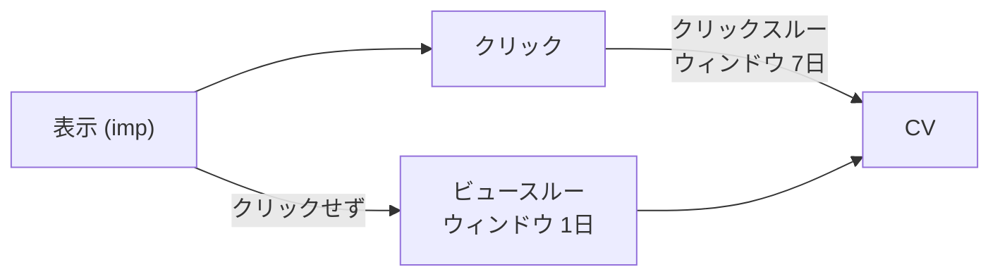
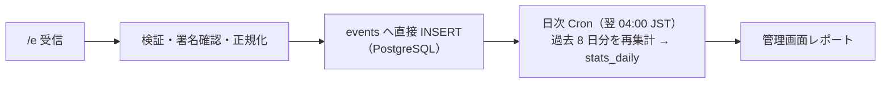

# 07. 計測仕様

## 1. 指標定義

| 指標 | 定義 | 計上タイミング |
| --- | --- | --- |
| imp | ポップアップが画面に描画され、**50% 以上が 1 秒以上可視**になった回数 | `IntersectionObserver` 判定後 1 回のみ |
| click | バナーのリンク領域のクリック / タップ | クリック直後（遷移前に `sendBeacon`） |
| close | × / オーバーレイ / ESC で閉じた | 閉じた直後 |
| holdout | 対照群に割り当てられ、表示しなかった | 表示判定通過時 |
| CV | 成果地点への到達のうち、ポップアップ接触にひもづくもの | CV タグ発火時 |
| — （CV の範囲） | 定期購入のため既定は **初回注文のみ**。継続注文は集計対象外 | `orderType = 'first'` |
| CTR | click ÷ imp | — |
| CVR | CV ÷ click（クリックスルー基準） | 画面上で分母を明示 |
| 増分 CVR | 表示あり群 CVR − 対照群 CVR | 対照群設定時のみ |

**重要**: 「imp = 描画された瞬間」ではなく「可視要件を満たした瞬間」とする。
タブが裏に回っている間に描画された分を imp に含めると CTR が実態より低く出るため。

## 2. アトリビューション

### 2.1 ルール

1. CV タグ発火時、`pz.touch`（直近接触の配列）から候補を抽出
2. **クリック接触を優先**。ウィンドウ内にクリック接触があればそれに帰属（`attribution = click`）
3. クリック接触が無く、ビューウィンドウ内に imp 接触があれば `attribution = view`
4. どちらも無ければ CV イベントは記録するが、キャンペーン紐付けなし（`attribution = none`）
5. 同一ウィンドウ内に複数接触がある場合は **ラストタッチ**（最後の接触に全量帰属）
6. 1 CV は 1 クリエイティブにのみ帰属する（重複計上しない）

### 2.1.1 カートが別ドメインの場合（スマレジ・リピート）

顧客ドメインとカートドメインが分かれる場合、接触情報は
**バナークリック時のリンク装飾（`pz_t`）でのみ引き継げます**。

| 種別 | 同一ドメイン | 別ドメイン |
| --- | --- | --- |
| クリックスルー CV | ✓ | ✓（`pz_t` で 100% 引き継ぎ） |
| ビュースルー CV | ✓ | **✗ 計測不可** |

別ドメイン構成では管理画面のビュースルー列を**非表示**にします。
0 件と表示すると「効果がなかった」と誤読されるためです。
このとき全体効果は holdout（対照群）による増分 CVR で測ります（5 章）。

### 2.2 ウィンドウ既定値

| 種別 | 既定 | 設定範囲 |
| --- | --- | --- |
| クリックスルー | 7 日 | 1〜30 日 |
| ビュースルー | 1 日 | 0（無効）〜7 日 |

- レポートでは `cv_click` と `cv_view` を**必ず分けて表示**する（合算だけ見せると効果を過大評価する）
- 既定の主要指標は `cv_click`。ビュースルーは補足列とする

### 2.3 Safari / ITP の影響

- ITP により JS 由来の localStorage は最長 7 日で削除されうる
- したがってクリックスルー 7 日を超える設定は Safari では実効しない → 管理画面に注意書き
- 精度が必要なクライアントには S2S CV API（`04-api.md` 1.4）を案内

## 3. 重複排除（冪等性）

| ケース | 対策 |
| --- | --- |
| 同一表示で imp が複数送信 | SDK 内フラグ + `event_id`(UUID) で サーバ側 dedup |
| サンクスページのリロード | `site_id + order_id` で dedup（先勝ち） |
| 再送キューによる二重送信 | `event_id` で dedup |
| ブラウザ CV と S2S CV の重複 | `order_id` で名寄せ。S2S を正とする |
| 定期購入の継続注文が CV に混入 | `orderType` で判別し、既定では `first` のみ集計 |

`events` テーブルの部分ユニークインデックス
（`(site_id, order_id) WHERE event_type='cv'`）により、DB レベルで重複を排除します。
アプリ側のチェック漏れがあっても二重計上は発生しません。

## 3.1 なりすまし CV の防止

別ドメイン構成では `pz_t` をユーザーが自分で付与できてしまうため、
**HMAC 署名の検証を必須**にします。

- 署名対象: `campaignId | creativeId | 発行日`（サイト秘密鍵で HMAC-SHA256）
- 秘密鍵はサーバのみが保持し、クライアントには署名済みトークンだけを配布する
- 有効期限は発行日から 7 日（CV ウィンドウと一致）
- 検証に失敗した `touch` は破棄し、CV は `attribution = none` として記録する
  （CV 自体は失わない。帰属だけを外す）

## 4. 不正・ノイズ対策

- `Origin` / `Referer` が `sites.allowed_hosts` に一致しないイベントは破棄
- UA がボット判定（既知クローラリスト + `navigator.webdriver`）の場合はフラグを立てて集計対象外
- 同一 `visitor_id` から 1 分間に 60 件超のイベント → レート制限し破棄
- `?pz_preview=` 付きアクセスは計測しない
- 社内 IP / 特定 `visitor_id` の除外リスト（管理画面から設定）

## 5. 集計パイプライン

この規模（月間 1 万 PV = imp 2,000 件程度）では、キューもストリーム処理も不要です。

- 管理画面は既定で `stats_daily` を参照。**当日分のみ `events` を直接集計**して UNION
  （当日のイベントは数十件程度のため、直クエリでも十分速い）
- 「速報値（当日）」「確定値（前日以前）」をラベルで区別する
- CV は遅れて到着する（クリックから最大 7 日後）ため、**毎回過去 8 日分を再集計**する
  → レポートに「直近 7 日の CV は増加する可能性があります」と注記
- 集計処理は `EventReader` インターフェース越しに実装し、
  将来イベントストアを差し替えても集計・レポート側を変更せずに済むようにする

## 6. タイムゾーン

- 集計は `sites.timezone`（既定 Asia/Tokyo）の暦日で行う
- 保存は UTC、集計・表示時に変換
- 日跨ぎの境界は `[00:00:00, 23:59:59.999]` のローカル時刻

## 7. プライバシー

| 項目 | 方針 |
| --- | --- |
| 収集する識別子 | 1st-party の `visitor_id`（ランダム UUID）のみ |
| 3rd-party Cookie | 使用しない |
| クロスサイト追跡 | 行わない（サイトごとに ID を分離） |
| 個人情報 | 収集しない。`orderId` は注文番号のみで、氏名・住所・メールは受け取らない |
| IP アドレス | 生ログには保存するが 90 日で削除。集計には使わない（地域集計は将来検討） |
| 同意管理 | CMP 連携 API を提供（`05-tag-sdk.md` 7 章） |
| 削除請求 | `visitor_id` 指定で該当イベントを削除する管理 API を用意 |
