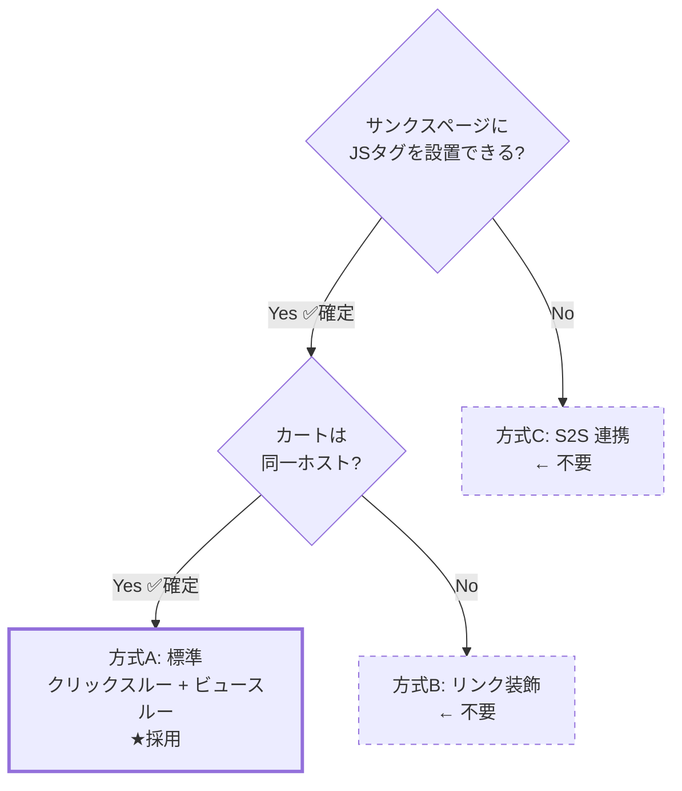
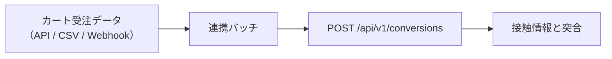
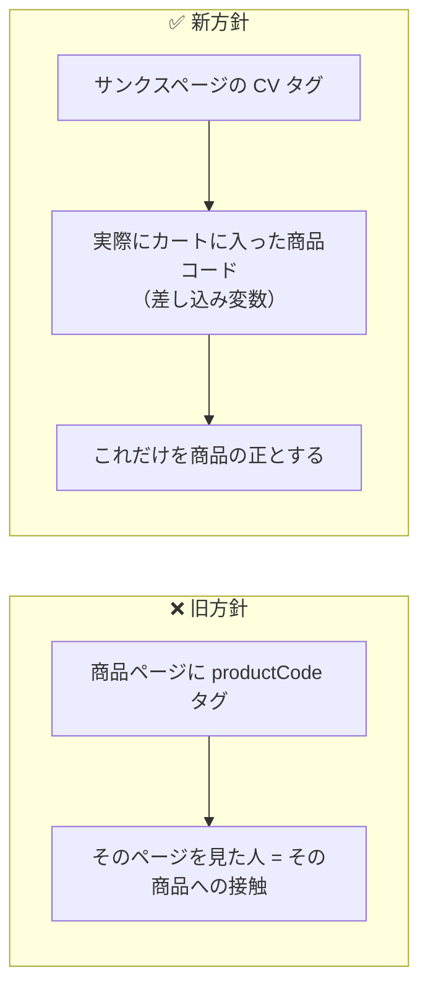

# 09. カート連携（スマレジ・リピート）

## 1. 前提と未確認事項

スマレジ・リピートは単品リピート通販（定期購入）向けのカートシステムです。
本設計は以下を前提に組んでいますが、**実装着手前に管理画面上で実機確認が必要**です。

### 1.1 チェックリスト（確認結果反映済み）

初期設置対象サイト: **https://www.primedirect.jp/** （株式会社プライムダイレクト）

| # | 確認事項 | 設計への影響 | 状態 |
| --- | --- | --- | --- |
| 1 | サンクスページ（ご注文完了）に**任意の JS タグを設置できるか** | 不可なら S2S 連携が必須になる | **✅ 可能** |
| 2 | タグ内で**注文番号・金額などの独自差し込み変数**が使えるか | 使えないと重複排除と売上計測ができない | **✅ 可能** |
| 3 | カート / サンクスページの**ホスト名** | 別ホストならリンク装飾が必須。ビュースルー CV は不可 | **✅ 確認済み → 全ステップ同一ホスト（下記 1.2）** |
| 2b | 差し込み変数の**正確な変数名** | CV タグの実装に直結 | 🔲 要取得（後日回答予定） |
| 6 | 商品ページ / LP は `www.primedirect.jp` 側か | タグ設置箇所とターゲティング設計 | **✅ 確認済み → 同一ホスト（下記 1.4）** |
| 8 | 定期購入の **2 回目以降の受注**も CV タグが発火するか | CV の定義（下記 3 章） | 🔲 要確認 |

> 残る未確認は **#2b（差し込み変数名）と #8（定期継続時の CV タグ発火）の 2 点のみ**。
> どちらも Phase 1 の実装と並行して確認できます。

> #1〜#3 が確定したことで、**方式C（S2S 連携）も方式B（リンク装飾）も不要**になりました。
> **方式A（標準構成）で確定**です。残るのは差し込み変数名と定期購入の挙動確認のみで、
> どちらも Phase 1 の実装と並行して進められます。

### 1.2 実機確認の結果（2026-08-11 実施）

購入フローを実際に進め、各画面の URL を取得しました。

| 画面 | URL |
| --- | --- |
| カート | `https://www.primedirect.jp/cart/?product_id=4212&transactionid=...` |
| お客様情報入力 | `https://www.primedirect.jp/shopping/` |
| お支払い方法 | `https://www.primedirect.jp/shopping/payment.php` |
| 注文確認 | `https://www.primedirect.jp/shopping/confirm.php` |
| ご注文完了 | `https://www.primedirect.jp/shopping/complete.php` |

**全ステップが `www.primedirect.jp` の単一ホストです。** → **方式A（標準構成）採用確定**。

追加で判明した仕様（設計への反映）:

- 個別注文は `transactionid`（トランザクション ID）というクエリパラメータで識別される
  → 商品ページ・カート・サンクスページが同一ホストのため、
    このパラメータを計測に使う必要はない（`visitorId` ベースの標準計測で十分）
- カートは `/cart/`、購入手続きは `/shopping/` 配下に集約されている
  → `allowedHosts` は `www.primedirect.jp` の 1 つのみで足りる。`cartHosts` の別設定は不要
- 配信除外パスとして `/cart/` `/shopping/` を初期設定に追加（`4.1` 節で反映）

### 1.3 商品ページの URL 確認結果 → 商品識別の方針を確定

例として頂いた 2 URL について、確認いただいた結果です。

| URL | ご回答 |
| --- | --- |
| `https://www.primedirect.jp/products/pm100/` | **`pm100` は商品コードではない**（URL 上のスラッグに過ぎない） |
| `https://www.primedirect.jp/protein.html` | **LP（複数商品を横断する紹介ページ）** |

**この結果を受けて、商品の識別方法を方針転換します。**

> ❌ 旧方針: 商品ページに商品コードタグを設置し、そのページを見た人 ＝ その商品への接触、とみなす
> ✅ 新方針: **サンクスページで受け取る「実際にカートに入った商品コード」**
> （スマレジ・リピートの差し込み変数）だけを商品の正とする

理由は単純です。**「どのページを見たか」と「実際に何を買ったか」は必ずしも一致しません。**
`pm100` のような URL 上の記号は商品を正しく表さず、`/protein.html` に至っては
複数商品が並ぶ LP なので、そもそも 1 商品に紐づけようがありません。
ページ側で商品を特定しようとする設計は、この時点で無理があったということです。

**カートイン商品コード方式に変えたことで得られるもの:**

- ページの URL 構造がどんなに複雑でも（商品ページ・LP が混在していても）影響を受けない
- 「実際に売れた商品」を正確に集計できる（ページ推測に基づく誤差が原理的にゼロになる）
- 商品ページに新しいタグを追加で設置する必要が**なくなる**（設置工数が減る）

**変わること:**

- 商品別レポートは **CV と売上のみ**を表示します（imp / click は持てません。
  「見られた回数」はページ側の情報が必要ですが、そのページと実購入商品の対応が
  取れない以上、正確な数字を出せないためです）
- 「どのページがよく見られ、クリックされたか」は**ページ別レポート**（URL ベース）で見ます。
  これは商品と紐付かない、純粋なエンゲージメント指標です
- キャンペーンの配信対象指定（対象ページ）も、商品コードではなく**URL ルールのみ**で行います
  （`06-admin.md` 2 章）

詳細な設計は `03-data-model.md`「商品（product_id）とページ（page_group_id）は
別軸として持つ」、CV タグの実装例は 4 章を参照してください。

### 1.4 参考: 公開情報から分かった範囲

| URL | 備考 |
| --- | --- |
| `/products/list.php` | 商品一覧。`.php` の拡張子付き構造 |
| `/entry/` | 会員登録 |
| `/category/` | カテゴリ一覧 |
| `/guide.html` `/store_faq.html` | 静的ページ |

- 商品ページの URL 形式（`/products/detail.php?product_id=` 形式か等）は #6 で確認予定。
  ただし**商品コードはタグから受け取るため、URL 形式は集計に影響しません**
- 注意: `/ecoca.html` は「エコカ」という**商品（ショッピングカート本体）**のページであり、
  カートシステムのページではありません

## 2. 計測方式の分岐



**プライムダイレクトの購入フローは全ステップ `www.primedirect.jp` の単一ホストのため、
方式A（標準構成）で確定しました。** `pz_t` によるリンク装飾も、署名の仕組みも不要です。
以降の節は参考情報として残しますが、実装では方式A のみを対象にします。

### 方式A: 同一ドメイン（★採用・プライムダイレクトはこれ）

`05-tag-sdk.md` の標準構成そのまま。localStorage の接触情報がそのまま読めるため、
クリックスルー CV・ビュースルー CV の**両方**が計測できます。
`pz_t` によるリンク装飾も、HMAC 署名の検証も不要です。実装が最も単純になります。

### 方式B: 別ドメイン + リンク装飾（不採用・参考情報として保持）

バナーのリンク先 URL に署名付きの接触情報を付与して引き継ぎます。

#### 送出側（LP・商品ページ）

```
元のリンク先:  https://cart.smaregi-repeat.example/item/1001
実際の遷移先:  https://cart.smaregi-repeat.example/item/1001?pz_t=eyJ2aWQiOi...
```

`pz_t` のペイロード（base64url された JSON）:

```jsonc
{
  "vid": "v_a1b2c3",       // visitorId
  "sid": "s_d4e5f6",       // sessionId
  "cid": 501,              // campaignId
  "crid": 9002,            // creativeId
  "pc": "1001",            // productCode（接触した商品ページ）
  "ts": 1786500000,        // 接触時刻（秒）
  "sig": "9f2a..."         // HMAC-SHA256（先頭 16 バイト）
}
```

- `sig` = HMAC(サイト秘密鍵, `vid|sid|cid|crid|ts`)。**秘密鍵はサーバのみが保持**し、
  署名は計測受信時に検証する（クライアントには鍵を配布しない）
- 署名生成はクリック時にサーバ往復すると遷移が遅れるため、
  **配信設定 JSON に「短命の署名済みトークン」を含めて配布**する方式を採る
  （設定 JSON はセッション単位ではないため、`vid/sid` は含めず `cid|crid|発行日` で署名し、
  改ざん検知の対象をキャンペーン・クリエイティブ・日付に限定する）

#### 受取側（カート・サンクスページ）

共通タグを設置し、SDK が起動時に以下を行います。

```ts
const t = new URLSearchParams(location.search).get('pz_t');
if (t) {
  const touch = decodeTouch(t);              // 形式・有効期限（7日）を検証
  saveTouch(touch);                          // カートオリジンの localStorage に保存
  history.replaceState({}, '', stripParam(location.href, 'pz_t')); // URL から除去
}
```

- カート内を回遊しても失われないよう、**localStorage に保存**（URL 依存にしない）
- サンクスページで CV タグが発火した際、この `touch` を CV イベントに添付する

#### レポート上の扱い

- ビュースルー CV は**列ごと非表示**にする（0 件表示は「効果がなかった」と誤読される）
- 管理画面のサイト設定に `crossDomainCart: true` を持たせ、UI を切り替える

### 方式C: S2S 連携（不採用・参考情報として保持）

サンクスページにタグを設置できない場合、受注データから CV を送信します。



突合キーの候補（上から優先）:

1. **注文時に `pz_t` を注文メモ / カスタム項目へ引き継げる場合** — 最も正確
2. `visitorId` をフォームの hidden 項目に埋め込める場合
3. 上記が不可なら、**注文時刻ベースの確率的突合は行わない**（精度が担保できないため）。
   この場合は個別 CV の帰属を諦め、**holdout による全体増分効果のみ**を計測する

> 3 の状態でも「ポップアップに効果があったか」は判定できます。
> 対照群と表示群の CV 数を比較すればよく、個別の紐付けは不要だからです。
> クリエイティブ別 CV は出せなくなりますが、**クリエイティブ別の CTR は出せる**ため、
> 運用上の意思決定（どのバナーを残すか）は継続できます。

## 3. 定期購入における CV の定義

単品リピート通販では「CV とは何か」を明確にする必要があります。

| 定義 | 内容 | 推奨 |
| --- | --- | --- |
| 初回注文のみ | 新規獲得を CV とする | **推奨（既定）** |
| 全注文 | 2 回目以降の定期継続も CV に含む | 非推奨（ポップアップの寄与ではない継続分が混入する） |
| 定期申込のみ | 単発購入を除外し定期コースの申込だけを CV とする | 事業 KPI 次第で選択可 |

CV タグに `orderType` を渡して区別します。

- 既定では `orderType = 'first'` のみを CV として集計
- レポートのフィルタで「初回のみ / すべて」を切り替え可能にする
- LTV 計測（継続回数・累計売上）は Phase 3 で検討。Phase 1 は初回獲得に絞る

### 3.1 CV タグの実装（スマレジ・リピート サンクスページ）

スマレジ・リピートの独自差し込み変数が使えることが確定したため、
サンクスページに以下を設置します。`{{...}}` の部分を**実際の変数名に置き換え**ます。

```html
<!-- 共通タグ（未設置なら先に設置） -->
<script async src="https://cdn.popup.example.com/t.js?sid=SITE_XXXX"></script>

<!-- コンバージョンタグ -->
<script>
(function () {
  window.pqz = window.pqz || [];
  var raw = {
    orderId  : '{{注文番号}}',
    value    : '{{商品合計金額}}',
    orderType: '{{初回フラグ}}',     // 例: 1=初回 / 0=継続、'新規'/'リピート' 等
    planType : '{{定期区分}}'        // 例: 定期 / 都度
  };
  // 差し込み変数が未展開のまま（'{{' が残る）場合は送らない
  function v(s) { return (s && s.indexOf('{{') === -1) ? s : ''; }

  var orderId = v(raw.orderId);
  if (!orderId) return;                        // 注文番号が無ければ送信しない

  window.pqz.push(['conversion', {
    orderId  : orderId,
    value    : Number(String(v(raw.value)).replace(/[^0-9.]/g, '')) || 0,
    currency : 'JPY',
    orderType: /^(1|初回|新規|first)$/.test(v(raw.orderType)) ? 'first' : 'recurring',
    planType : /定期|subscription/.test(v(raw.planType)) ? 'subscription' : 'onetime'
  }]);
})();
</script>
```

#### 実装上の注意（実際の事故が起きやすい箇所）

| 論点 | 対策 |
| --- | --- |
| 変数が未対応で `{{注文番号}}` が文字列のまま出力される | `v()` で検知し送信しない。**未展開の文字列を注文番号として送ると、全 CV が同一 orderId になり 1 件しか計上されない**（部分ユニークインデックスで弾かれる） |
| 金額が `¥5,400` 等の書式付きで出力される | 数字以外を除去してから `Number()` |
| 注文番号が空 | 送信しない（重複排除キーが無い CV は計上しない） |
| 初回フラグの値が想定と違う | 正規表現で複数表記に対応。**設置後にテスト購入で必ず実値を確認**する |
| サンクスページのリロードで二重発火 | サーバ側で `site_id + order_id` により DB レベルで排除 |

#### #2b で取得すべき情報

スマレジ・リピートの管理画面にある**差し込み変数の一覧**から、以下の変数名を確認してください。

| 用途 | 必須 | 備考 |
| --- | --- | --- |
| 注文番号 | **必須** | 重複排除キー。これが無いと CV 計測が成立しない |
| **カートイン商品コード** | **★必須（新方針）** | 商品別レポートの唯一のキー。1.3 節の方針転換により最重要項目に格上げ |
| 商品合計金額（税抜） | 推奨 | 売上レポート用。無ければ CV 件数のみ計測 |
| 初回 / 継続の区別 | 推奨 | 無い場合は全注文を CV として計上し、レポートで注記する |
| 定期 / 都度の区別 | 任意 | あれば分析軸が増える |

> 変数一覧のスクリーンショットを頂ければ、**そのまま貼り付けられる完成形のタグ**を作成します。
> 「カートイン商品コード」は、注文明細・購入商品・商品コードといった名称の変数として
> 用意されていることが多いです。

## 4. 商品の識別方式（確定：カートイン商品コード方式）

### 4.1 何が変わったか

1.3 節の確認結果（`pm100` は商品コードでない・`protein.html` は LP）を受けて、
商品の識別を**ページ側のタグ**から**サンクスページの CV タグ**に一本化しました。



商品ページ・LP には**商品コードタグを設置しません**。
imp / click は URL ベースの `page_groups` で分類し（エンゲージメント集計）、
商品別の売上・CV は CV タグの `productCode` のみで集計します（`03-data-model.md` 参照）。

### 4.2 CV タグへの反映

`3.1` 節の CV タグに、カートイン商品コードを追加します。

```html
<script>
(function () {
  window.pqz = window.pqz || [];
  var raw = {
    orderId    : '{{注文番号}}',
    value      : '{{商品合計金額}}',
    orderType  : '{{初回フラグ}}',
    planType   : '{{定期区分}}',
    productCode: '{{カートイン商品コード}}'   // ★ 変数名は 3.1 節の質問で確認
  };
  function v(s) { return (s && s.indexOf('{{') === -1) ? s : ''; }

  var orderId = v(raw.orderId);
  if (!orderId) return;

  window.pqz.push(['conversion', {
    orderId    : orderId,
    productCode: v(raw.productCode) || null,   // 空 or 未展開なら null（商品別レポートには乗らない）
    value      : Number(String(v(raw.value)).replace(/[^0-9.]/g, '')) || 0,
    currency   : 'JPY',
    orderType  : /^(1|初回|新規|first)$/.test(v(raw.orderType)) ? 'first' : 'recurring',
    planType   : /定期|subscription/.test(v(raw.planType)) ? 'subscription' : 'onetime'
  }]);
})();
</script>
```

### 4.3 複数商品を同時購入した注文の扱い（要確認）

スマレジ・リピートは単品リピート通販のため、**1 注文 1 商品が基本**と想定しています。
ただし、まとめ買い・同梱等で 1 注文に複数商品が含まれるケースがある場合、
差し込み変数がどう返るか（例: カンマ区切りで複数コードが入る／主要 1 件のみ等）を
ご確認ください。

- 単一コードのみ返る場合 → そのまま `productCode` に設定（上記のまま実装可能）
- 複数コードが返りうる場合 → 商品ごとに売上を按分する `order_items` 方式が必要になるため、
  Phase 2 での対応とし、Phase 1 では**注文の主要 1 商品のみ**を記録します

### 4.4 ターゲティングへの影響

キャンペーンの配信対象ページ指定は、商品コードではなく**URL ルールのみ**で行います
（`06-admin.md` 2 章）。ページから商品を確実に特定できない以上、
「この商品のページにだけ出す」という指定はできません。
「`/products/` 配下すべてに出す」「`/protein.html` にだけ出す」といった
**URL パターンでの指定**で運用します。

## 4.5 初期導入サイトの設定値（www.primedirect.jp）

Phase 1 で登録するサイト設定の初期値。

```jsonc
{
  "name": "プライムダイレクト",
  "allowedHosts": ["www.primedirect.jp", "primedirect.jp"],
  "cartHosts": [],              // 単一ホスト構成のため空でよい（cart モード自体を使わない）
  "crossDomainCart": false,     // ✅ 確定: 単一ホストのため false
  "timezone": "Asia/Tokyo",
  "cvClickWindowDays": 7,
  "cvViewWindowDays": 1,
  "cvCountRecurring": false     // 初回注文のみを CV とする
}
```

配信対象から**既定で除外**するページ（購入動線を妨げないため。1.2 の実機確認結果を反映）:

- `/cart/`（カート）
- `/shopping/`（お客様情報入力・お支払い方法・注文確認・ご注文完了 一式）
- 会員登録 (`/entry/`)、ログイン、マイページ

`www.primedirect.jp` は `www` 有無の両方を許可ホストに入れておきます
（リダイレクト設定によっては両方からイベントが届くため）。

初期登録するページグループ（エンゲージメント集計用。1.3 節参照）:

| 名前 | ルール |
| --- | --- |
| 商品詳細ページ全体 | 前方一致 `/products/` |
| protein.html（LP） | 完全一致 `/protein.html` |

## 5. 導入手順（顧客向け）

1. 管理画面でサイトを作成 → 共通タグを取得
2. 全ページの `</head>` 直前に共通タグを設置（プライムダイレクトは単一ドメインのため 1 種類のみ）
3. **サンクスページ**: 共通タグ + CV タグ（カートイン商品コードを含む）を設置
4. ページグループを設定（`/products/` 配下・`/protein.html` 等の URL ルール）
5. 管理画面の「タグ設置チェッカー」で受信確認
   - 共通タグ: 受信あり / なし
   - CV タグ: 受信あり / なし
   - CV タグの商品コード: 受信済み商品コード一覧（空なら差し込み変数を再確認）
6. テスト表示（`?pz_preview=` 付き URL）で見た目を確認
7. テスト購入を 1 件行い、CV と商品コードが正しく計上されることを確認 → 配信開始

## 6. 顧客サイトへの影響を抑える配慮

- カートページ・サンクスページでは**ポップアップを表示しない**のを既定にする
  （購入動線の妨害を防ぐ。設定で解除は可能）
- カート側に設置する共通タグは、`pz_t` 受け取りと CV 送信のみを行う軽量モードで動作させる
  （設定 JSON の取得はするが、トリガー監視・描画は行わない）
- スマレジ・リピート側のフォーム挙動に干渉しないよう、
  カートドメインでは `history.pushState`（戻るボタン検知）を**強制的に無効化**する
