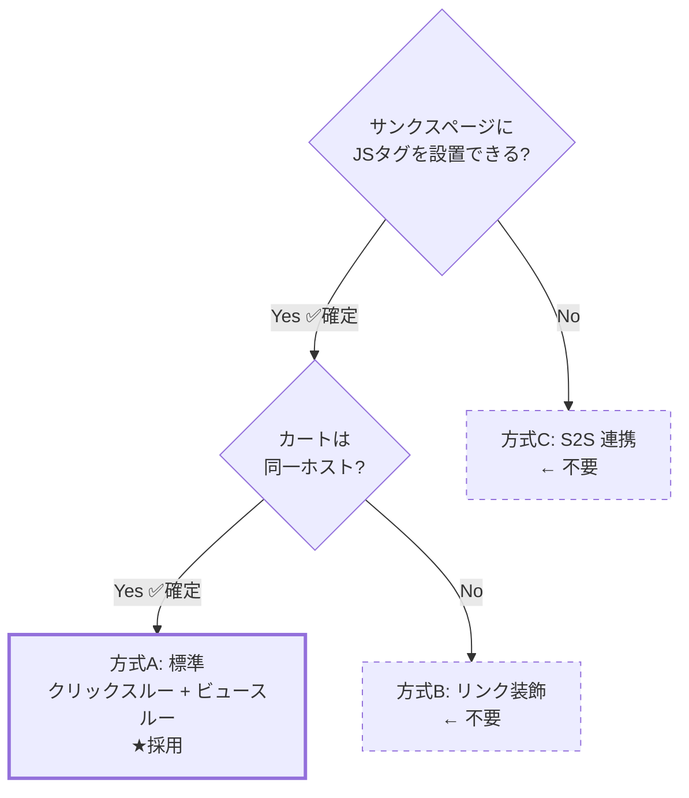
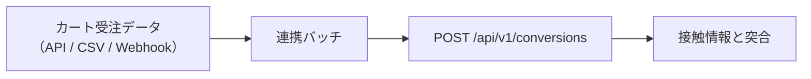
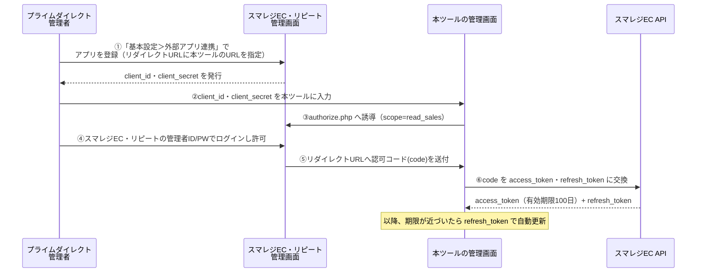
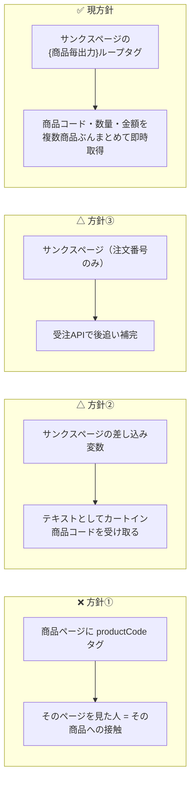

# 09. カート連携（スマレジ・リピート）

## 1. 前提と未確認事項

スマレジ・リピートは単品リピート通販（定期購入）向けのカートシステムです。
本設計は以下を前提に組んでいますが、**実装着手前に管理画面上で実機確認が必要**です。

### 1.1 チェックリスト（確認結果反映済み）

初期設置対象サイト: **https://www.primedirect.jp/** （株式会社プライムダイレクト）

| # | 確認事項 | 設計への影響 | 状態 |
| --- | --- | --- | --- |
| 1 | サンクスページ（ご注文完了）に**任意の JS タグを設置できるか** | 不可なら S2S 連携が必須になる | **✅ 可能** |
| 2 | タグ内で**注文番号・金額などの独自差し込み変数**が使えるか | 使えないと重複排除と売上計測ができない | **✅ 可能** |
| 3 | カート / サンクスページの**ホスト名** | 別ホストならリンク装飾が必須。ビュースルー CV は不可 | **✅ 確認済み → 全ステップ同一ホスト（下記 1.2）** |
| 2b | 差し込み変数の**正確な変数名** | CV タグの実装に直結 | 🔲 要取得（後日回答予定） |
| 6 | 商品ページ / LP は `www.primedirect.jp` 側か | タグ設置箇所とターゲティング設計 | **✅ 確認済み → 同一ホスト（下記 1.4）** |
| 8 | 定期購入の **2 回目以降の受注**も CV タグが発火するか | CV の定義（下記 3 章） | 🔲 要確認 |

> 残る未確認は **#2b（差し込み変数名）と #8（定期継続時の CV タグ発火）の 2 点のみ**。
> どちらも Phase 1 の実装と並行して確認できます。

> #1〜#3 が確定したことで、**方式C（S2S 連携）も方式B（リンク装飾）も不要**になりました。
> **方式A（標準構成）で確定**です。残るのは差し込み変数名と定期購入の挙動確認のみで、
> どちらも Phase 1 の実装と並行して進められます。

### 1.2 実機確認の結果（2026-08-11 実施）

購入フローを実際に進め、各画面の URL を取得しました。

| 画面 | URL |
| --- | --- |
| カート | `https://www.primedirect.jp/cart/?product_id=4212&transactionid=...` |
| お客様情報入力 | `https://www.primedirect.jp/shopping/` |
| お支払い方法 | `https://www.primedirect.jp/shopping/payment.php` |
| 注文確認 | `https://www.primedirect.jp/shopping/confirm.php` |
| ご注文完了 | `https://www.primedirect.jp/shopping/complete.php` |

**全ステップが `www.primedirect.jp` の単一ホストです。** → **方式A（標準構成）採用確定**。

追加で判明した仕様（設計への反映）:

- 個別注文は `transactionid`（トランザクション ID）というクエリパラメータで識別される
  → 商品ページ・カート・サンクスページが同一ホストのため、
    このパラメータを計測に使う必要はない（`visitorId` ベースの標準計測で十分）
- カートは `/cart/`、購入手続きは `/shopping/` 配下に集約されている
  → `allowedHosts` は `www.primedirect.jp` の 1 つのみで足りる。`cartHosts` の別設定は不要
- 配信除外パスとして `/cart/` `/shopping/` を初期設定に追加（`4.1` 節で反映）

### 1.3 商品ページの URL 確認結果 → 商品識別の方針を確定

例として頂いた 2 URL について、確認いただいた結果です。

| URL | ご回答 |
| --- | --- |
| `https://www.primedirect.jp/products/pm100/` | **`pm100` は商品コードではない**（URL 上のスラッグに過ぎない） |
| `https://www.primedirect.jp/protein.html` | **LP（複数商品を横断する紹介ページ）** |

**この結果を受けて、商品の識別方法を方針転換します。**

> ❌ 旧方針: 商品ページに商品コードタグを設置し、そのページを見た人 ＝ その商品への接触、とみなす
> ✅ 新方針: **実際にカートに入った商品コード**だけを商品の正とする
> （具体的な取得元は、その後の受注API 確認結果を踏まえ 3〜4 章で確定しています）

理由は単純です。**「どのページを見たか」と「実際に何を買ったか」は必ずしも一致しません。**
`pm100` のような URL 上の記号は商品を正しく表さず、`/protein.html` に至っては
複数商品が並ぶ LP なので、そもそも 1 商品に紐づけようがありません。
ページ側で商品を特定しようとする設計は、この時点で無理があったということです。

**カートイン商品コード方式に変えたことで得られるもの:**

- ページの URL 構造がどんなに複雑でも（商品ページ・LP が混在していても）影響を受けない
- 「実際に売れた商品」を正確に集計できる（ページ推測に基づく誤差が原理的にゼロになる）
- 商品ページに新しいタグを追加で設置する必要が**なくなる**（設置工数が減る）

**変わること:**

- 商品別レポートは **CV と売上のみ**を表示します（imp / click は持てません。
  「見られた回数」はページ側の情報が必要ですが、そのページと実購入商品の対応が
  取れない以上、正確な数字を出せないためです）
- 「どのページがよく見られ、クリックされたか」は**ページ別レポート**（URL ベース）で見ます。
  これは商品と紐付かない、純粋なエンゲージメント指標です
- キャンペーンの配信対象指定（対象ページ）も、商品コードではなく**URL ルールのみ**で行います
  （`06-admin.md` 2 章）

詳細な設計は `03-data-model.md`「商品（product_id）とページ（page_group_id）は
別軸として持つ」、CV タグの実装例は 4 章を参照してください。

### 1.4 参考: 公開情報から分かった範囲

| URL | 備考 |
| --- | --- |
| `/products/list.php` | 商品一覧。`.php` の拡張子付き構造 |
| `/entry/` | 会員登録 |
| `/category/` | カテゴリ一覧 |
| `/guide.html` `/store_faq.html` | 静的ページ |

- 商品ページの URL 形式（`/products/detail.php?product_id=` 形式か等）は #6 で確認予定。
  ただし**商品コードはタグから受け取るため、URL 形式は集計に影響しません**
- 注意: `/ecoca.html` は「エコカ」という**商品（ショッピングカート本体）**のページであり、
  カートシステムのページではありません

## 2. 計測方式の分岐



**プライムダイレクトの購入フローは全ステップ `www.primedirect.jp` の単一ホストのため、
方式A（標準構成）で確定しました。** `pz_t` によるリンク装飾も、署名の仕組みも不要です。
以降の節は参考情報として残しますが、実装では方式A のみを対象にします。

### 方式A: 同一ドメイン（★採用・プライムダイレクトはこれ）

`05-tag-sdk.md` の標準構成そのまま。localStorage の接触情報がそのまま読めるため、
クリックスルー CV・ビュースルー CV の**両方**が計測できます。
`pz_t` によるリンク装飾も、HMAC 署名の検証も不要です。実装が最も単純になります。

### 方式B: 別ドメイン + リンク装飾（不採用・参考情報として保持）

バナーのリンク先 URL に署名付きの接触情報を付与して引き継ぎます。

#### 送出側（LP・商品ページ）

```
元のリンク先:  https://cart.smaregi-repeat.example/item/1001
実際の遷移先:  https://cart.smaregi-repeat.example/item/1001?pz_t=eyJ2aWQiOi...
```

`pz_t` のペイロード（base64url された JSON）:

```jsonc
{
  "vid": "v_a1b2c3",       // visitorId
  "sid": "s_d4e5f6",       // sessionId
  "cid": 501,              // campaignId
  "crid": 9002,            // creativeId
  "pc": "1001",            // productCode（接触した商品ページ）
  "ts": 1786500000,        // 接触時刻（秒）
  "sig": "9f2a..."         // HMAC-SHA256（先頭 16 バイト）
}
```

- `sig` = HMAC(サイト秘密鍵, `vid|sid|cid|crid|ts`)。**秘密鍵はサーバのみが保持**し、
  署名は計測受信時に検証する（クライアントには鍵を配布しない）
- 署名生成はクリック時にサーバ往復すると遷移が遅れるため、
  **配信設定 JSON に「短命の署名済みトークン」を含めて配布**する方式を採る
  （設定 JSON はセッション単位ではないため、`vid/sid` は含めず `cid|crid|発行日` で署名し、
  改ざん検知の対象をキャンペーン・クリエイティブ・日付に限定する）

#### 受取側（カート・サンクスページ）

共通タグを設置し、SDK が起動時に以下を行います。

```ts
const t = new URLSearchParams(location.search).get('pz_t');
if (t) {
  const touch = decodeTouch(t);              // 形式・有効期限（7日）を検証
  saveTouch(touch);                          // カートオリジンの localStorage に保存
  history.replaceState({}, '', stripParam(location.href, 'pz_t')); // URL から除去
}
```

- カート内を回遊しても失われないよう、**localStorage に保存**（URL 依存にしない）
- サンクスページで CV タグが発火した際、この `touch` を CV イベントに添付する

#### レポート上の扱い

- ビュースルー CV は**列ごと非表示**にする（0 件表示は「効果がなかった」と誤読される）
- 管理画面のサイト設定に `crossDomainCart: true` を持たせ、UI を切り替える

### 方式C: S2S 連携（不採用・参考情報として保持）

サンクスページにタグを設置できない場合、受注データから CV を送信します。



突合キーの候補（上から優先）:

1. **注文時に `pz_t` を注文メモ / カスタム項目へ引き継げる場合** — 最も正確
2. `visitorId` をフォームの hidden 項目に埋め込める場合
3. 上記が不可なら、**注文時刻ベースの確率的突合は行わない**（精度が担保できないため）。
   この場合は個別 CV の帰属を諦め、**holdout による全体増分効果のみ**を計測する

> 3 の状態でも「ポップアップに効果があったか」は判定できます。
> 対照群と表示群の CV 数を比較すればよく、個別の紐付けは不要だからです。
> クリエイティブ別 CV は出せなくなりますが、**クリエイティブ別の CTR は出せる**ため、
> 運用上の意思決定（どのバナーを残すか）は継続できます。

## 3. 定期購入における CV の定義

単品リピート通販では「CV とは何か」を明確にする必要があります。

| 定義 | 内容 | 推奨 |
| --- | --- | --- |
| 初回注文のみ | 新規獲得を CV とする | **推奨（既定）** |
| 全注文 | 2 回目以降の定期継続も CV に含む | 非推奨（ポップアップの寄与ではない継続分が混入する） |
| 定期申込のみ | 単発購入を除外し定期コースの申込だけを CV とする | 事業 KPI 次第で選択可 |

判定方法は 3.4 節で確定します。

### 3.1 CV タグの方式 → さらに更新（差し込みタグ一覧を受領）

> **設計の更新履歴**:
> ① 当初はページ側の商品コードタグを想定 → `pm100` が商品コードでないと判明し撤回
> ② 次に「受注API から後追いで補完する」2 段階方式を設計
> ③ **実際のサンクスページ差し込みタグ一覧を頂いた結果、③に更新**:
>    このカートには `{商品毎出力}{/商品毎出力}` という**繰り返しタグ**があり、
>    商品コード・数量・金額を**注文完了画面から直接、複数商品ぶんまとめて**
>    取得できることが分かりました。受注APIの応答を待たずに、
>    **画面到達と同時に正確なデータが揃います。**

いただいた差し込みタグ一覧（抜粋・CV 計測に使うもの）:

| タグ | 内容 | 出力例 | 有効画面 |
| --- | --- | --- | --- |
| `{注文番号}` | 注文番号 | `165` | 注文完了画面 |
| `{商品コード}` | 商品コード | `PK001` | カート/確認/注文完了 |
| `{商品名}` | 商品名 | `sampleA` | カート/確認/注文完了 |
| `{注文個数}` | 購入数量 | `2` | 注文完了画面 |
| `{商品代金合計(税別)}` | 明細の合計金額（税別） | `2000` | カート/確認/注文完了 |
| `{注文金額合計(税別)}` | 注文全体の合計（送料込） | `2500` | 注文完了画面 |
| `{消費税}` | 消費税額 | `160` | 注文完了画面 |
| `{顧客ID}` | 注文者の顧客ID | `57` | カート/確認/ログイン後 |
| `{商品毎出力}` `{/商品毎出力}` | 囲んだタグを**商品の数だけ繰り返す** | — | カート/確認/注文完了 |

**唯一見当たらなかったのが「初回 / 継続（2回目以降）の区別」を示すタグです。**
このタグ一覧には該当するものがないため、この判定だけは受注API の
`order.order_cnt`（購入回数）を使う、**ハイブリッド方式**にします（3.4 節）。

### 3.2 新しい CV タグの実装（ループタグで複数商品に対応）

```html
<!-- 共通タグ（未設置なら先に設置） -->
<script async src="https://cdn.popup.example.com/t.js?sid=SITE_XXXX"></script>

<!-- コンバージョンタグ -->
<script>
(function () {
  window.pqz = window.pqz || [];
  var orderId = '{注文番号}';
  // 未展開のまま（'{' が残る）なら送信しない
  if (!orderId || orderId.indexOf('{') !== -1) return;

  window.pqz.push(['conversion', {
    orderId: orderId,
    customerId: '{顧客ID}',
    revenueExTax: {注文金額合計(税別)},
    tax: {消費税},
    items: [
      {商品毎出力}{ code: '{商品コード}', qty: {注文個数}, revenueExTax: {商品代金合計(税別)} },{/商品毎出力}
    ]
  }]);
})();
</script>
```

このタグが実際に展開されると、2 商品を含む注文では次のような JSON が
ブラウザ上でそのまま組み立てられます（`{商品毎出力}`〜`{/商品毎出力}` の中身が
商品の数だけ繰り返されるため）。

```js
{
  orderId: '165',
  customerId: '57',
  revenueExTax: 2500,
  tax: 160,
  items: [
    { code: 'PK001', qty: 2, revenueExTax: 2000 },
    { code: 'PK002', qty: 1, revenueExTax: 500 },
  ]   // 末尾のカンマは JS の配列リテラルとして許容される
}
```

**この方式の利点:**

- **1 注文に複数商品が含まれる場合も、`items` 配列にそのまま入る**
  （懸念だった論点がこれで解消。API の応答を待つ必要もない）
- 金額・数量・商品コードは、注文完了画面到達と**同時に**確定する（遅延ゼロ）
- 数値タグ（`{注文個数}` 等）はブラウザ側でパース不要 = 型崩れ・書式ゆれのリスクが
  そもそも発生しない（`¥5,400` のようなテキストではなく、数値としてそのまま出力される）

**注意点:**

- `{商品コード}` 等に**引用符やアポストロフィが含まれる商品名・コードがあると
  JS の文字列リテラルが壊れる**リスクがあります（可能性は低いですが、
  商品コード・商品名に `'` を使わない運用を推奨します。実装時にエスケープ処理も入れます）
- サンクスページのリロードによる二重発火は、`site_id + order_id` の
  部分ユニークインデックスでサーバ側が排除する

### 3.3 CV イベントの反映（ほぼ即時確定）

`items` 配列を含む CV イベントが届いた時点で、商品コードは
`products` テーブルへ自動 upsert、`order_items` へ明細を書き込みます。
**受注API の応答を待たずに、商品別レポート・売上は即座に確定します。**

唯一 `order_type`（初回/継続）だけは、3.4 節のとおり受注API からの
補完を待つため、それまでは `order_type = null`（未判定）として扱います。

### 3.4 「初回 / 継続」判定のみ受注APIを併用

差し込みタグに該当するものが無いため、この 1 点だけ受注API から取得します。

```
GET/POST https://www.primedirect.jp/api/v2/orders/search
Authorization: Bearer {access_token}

search_options:
  order_id_from / order_id_to: "{注文番号}"   ← {注文番号} タグの値（例: 165）は
                                                 order.order_id（受注ID）に対応すると推定
  response_options: { response_type: "json" }
```

| 受注APIの項目 | 用途 |
| --- | --- |
| `order.order_id` | CV タグの `{注文番号}`（例: `165`）との突合キー（**要確認**: `{注文番号}` が `order.order_id` と `order.ec_order_id` のどちらに対応するか） |
| `order.order_cnt`（購入回数） | `1` なら `orderType = 'first'`、それ以外は `'recurring'` |

- 同期バッチは数分おきに、直近の `pending`（`order_type` 未確定）な CV をまとめて問い合わせる
- 商品・売上のレポートは API を待たずに出るため、**このバッチが遅延・失敗しても
  影響は「初回/継続の区別が一時的に付かない」ことだけ**に限定される（設計上の保険が効いている）
- 8 日を超えても `order_type` が確定しない CV は「全注文」扱いでレポートに含め、
  「初回判定できず」の注記を付ける（初回のみに絞ると集計から漏れてしまうため）

### 3.5 認証方式（確定：OAuth2 認可コードフロー）

> **重要な設計変更**: 当初「管理画面でアクセストークンを発行してそのまま渡す」
> 想定でしたが、実際には**標準的な OAuth2 認可コードフロー**でした。
> 単発のトークン発行ではなく、**サイトごとに 1 度だけ行う連携手続きと、
> 継続的なトークン更新の仕組み**が必要になります。

#### 連携の全体像



#### 実装への影響

| 論点 | 対応 |
| --- | --- |
| **各サイトごとに 1 回、連携手続きが必要** | 管理画面に「受注API連携」ボタンを設け、①〜④の手順をガイドする（`06-admin.md`） |
| **本ツール側に、認可コードを受け取る URL が必要** | サイトごとの callback URL（`/api/v1/sites/{id}/order-api/callback`）を用意し、①でプライムダイレクト様に登録いただく |
| **アクセストークンは 100 日で失効する** | `expires_in` を保存し、期限の 10 日前を目安に `refresh_token` で自動更新するバッチを設ける |
| **`client_secret` は機密情報** | DB には暗号化して保存し、管理画面には再表示しない（クライアント側 JS にも一切渡さない） |
| **`refresh_token` を使った更新方法** | 頂いた案内には明記が無いため、標準的な OAuth2 の作法（`grant_type=refresh_token`）を想定して実装し、**実機で早めに疎通確認**する |
| **scope** | `read_sales`（受注データ参照）のみを要求する |

### 3.6 実装のために確認したいこと（更新）

| # | 確認事項 | 備考 |
| --- | --- | --- |
| 1 | `{注文番号}` の値（例 `165`）は、受注API の `order.order_id`・`order.ec_order_id` の**どちらと一致するか** | 3.4 節の突合キーの選定に必須 |
| 2 | `order.order_cnt`（購入回数）は「その顧客の通算注文回数」で合っているか | 初回/継続判定の正確性に関わる |
| 3 | 「初回 / 継続（2回目以降）」を示す差し込みタグが、頂いた一覧以外に存在しないか | あれば OAuth 連携自体が不要になり、大幅に単純化できる（4 章末の検討事項も参照） |
| 4 | 受注APIの呼び出しレート制限（任意） | 同期バッチの間隔設計に影響 |

**「基本設定＞外部アプリ連携」でのアプリ登録は、実装が固まった段階で
プライムダイレクト様に実施いただきます**（callback URL を先にこちらで発行するため）。
現時点でトークンを頂く必要はありません。

### 3.7 検討事項: OAuth 連携は「初回/継続の判定 1 点」に見合うか

OAuth2 認可コードフローの実装（連携 UI・callback 処理・トークンの暗号化保存・
100 日ごとの自動更新バッチ・失効時のリカバリ導線）は、**軽くない実装コスト**です。
これを「初回か 2 回目以降か」という**1 個の真偽値**のためだけに作る価値があるかは、
検討の余地があります。代替案を並べます。

| 案 | 内容 | 精度 | 実装コスト |
| --- | --- | --- | --- |
| **A. OAuth連携を実装する**（現設計） | 3.5 節のとおり | 高い（`order_cnt` に基づく正確な判定） | 高い |
| **B. Phase 1 では判定しない** | 全 CV を `order_type='unknown'` とし、初回/継続で分けずに集計する。Phase 2 で OAuth 実装を検討 | 判定なし（全件を対象にレポート） | ゼロ |
| **C. 差し込みタグで代替できないか、もう一度確認する** | 「初回購入」「新規顧客」等の別名で存在する可能性がある（3.6 節 #3） | 高い（あれば） | ほぼゼロ |
| **D. `{会員登録日時}` タグで簡易推定** | 会員登録日時と注文日時が近ければ「初回」とみなす簡易ヒューリスティック | 中〜低（誤判定あり得る。2回目の来店が会員登録と同時とは限らない） | 低い |

**推奨は C → 見つからなければ B（Phase 1 は判定なしで進め、OAuth 実装は Phase 2 に回す）です。**
月間 1 万 PV 規模では初回/継続の内訳よりも、まず配信・計測の土台を早く動かす方が
優先度が高いという判断です。ただし、「初回獲得の効果」が最重要 KPI であれば
A を Phase 1 に含める判断もあり得ます。**この優先度判断は事業側で決めていただく
必要があります**（8 章参照）。

## 4. 商品の識別方式（確定：サンクスページのループタグ方式）

### 4.1 何が変わったか（3 段階の方針転換）

1.3 節の確認結果（`pm100` は商品コードでない・`protein.html` は LP）を受けて、
方針を 3 段階でアップデートしました。



実際の差し込みタグ一覧を頂いた結果、`{商品毎出力}{/商品毎出力}` という
繰り返しタグで商品明細を直接・複数商品ぶんまとめて取得できることが分かったため、
**受注APIへの依存を「初回/継続の判定」1点だけに縮小しました**（3.1〜3.4 節）。

商品ページ・LP には**商品コードタグを設置しません**。
imp / click は URL ベースの `page_groups` で分類し（エンゲージメント集計）、
商品別の売上・CV は**サンクスページのループタグから取得した `items[].code`**
（`order_items` として保存）で集計します（`03-data-model.md` 参照）。

### 4.2 1 注文に複数商品が含まれる場合（解決済み）

`{商品毎出力}{/商品毎出力}` タグが商品の数だけ繰り返し展開されるため、
**最初から標準対応できます**（3.2 節）。

- CV タグの `items` 配列に、商品ごとの `code` / `qty` / `revenueExTax` がそのまま入る
- `order_items` テーブル（`03-data-model.md`）に、明細を 1 行 1 レコードとして書き込む
- 受注API の応答を待つ必要がないため、Phase 1 から複数商品注文に**即時**対応できる

### 4.3 ターゲティングへの影響

キャンペーンの配信対象ページ指定は、商品コードではなく**URL ルールのみ**で行います
（`06-admin.md` 2 章）。ページから商品を確実に特定できない以上、
「この商品のページにだけ出す」という指定はできません。
「`/products/` 配下すべてに出す」「`/protein.html` にだけ出す」といった
**URL パターンでの指定**で運用します。

## 4.4 初期導入サイトの設定値（www.primedirect.jp）

Phase 1 で登録するサイト設定の初期値。

```jsonc
{
  "name": "プライムダイレクト",
  "allowedHosts": ["www.primedirect.jp", "primedirect.jp"],
  "cartHosts": [],              // 単一ホスト構成のため空でよい（cart モード自体を使わない）
  "crossDomainCart": false,     // ✅ 確定: 単一ホストのため false
  "timezone": "Asia/Tokyo",
  "cvClickWindowDays": 7,
  "cvViewWindowDays": 1,
  "cvCountRecurring": false,    // 初回注文のみを CV とする（order_cnt=1 判定）
  "orderApi": {
    "enabled": false,           // 3.7 節の判断待ち。C/B案の場合は false のまま Phase 1 を進める
    "purpose": "order_type_only", // 商品コード・金額はサンクスページのタグから即時取得。API は初回/継続判定のみに使用
    "oauth": {
      "authorizeUrl": "https://www.primedirect.jp/api/oauth/authorize.php",
      "tokenUrl": "https://www.primedirect.jp/api/oauth/token.php",
      "clientId": "（プライムダイレクト様が発行・登録後に設定）",
      "clientSecret": "（暗号化して保管。管理画面には再表示しない）",
      "redirectUri": "https://app.popup.example.com/api/v1/sites/{siteId}/order-api/callback",
      "scope": "read_sales",
      "accessToken": null,
      "refreshToken": null,
      "expiresAt": null,        // 発行から100日。10日前を目安に自動更新
      "orderIdField": "order_id" // 3.6 節 #1 の確認結果で 'ec_order_id' に変更する可能性あり
    }
  }
}
```

配信対象から**既定で除外**するページ（購入動線を妨げないため。1.2 の実機確認結果を反映）:

- `/cart/`（カート）
- `/shopping/`（お客様情報入力・お支払い方法・注文確認・ご注文完了 一式）
- 会員登録 (`/entry/`)、ログイン、マイページ

`www.primedirect.jp` は `www` 有無の両方を許可ホストに入れておきます
（リダイレクト設定によっては両方からイベントが届くため）。

初期登録するページグループ（エンゲージメント集計用。1.3 節参照）:

| 名前 | ルール |
| --- | --- |
| 商品詳細ページ全体 | 前方一致 `/products/` |
| protein.html（LP） | 完全一致 `/protein.html` |

## 5. 導入手順（顧客向け）

1. 管理画面でサイトを作成 → 共通タグを取得
2. 全ページの `</head>` 直前に共通タグを設置（プライムダイレクトは単一ドメインのため 1 種類のみ）
3. **サンクスページ**: 共通タグ + CV タグ（`{商品毎出力}` ループを含む・3.2 節）を設置
4. ページグループを設定（`/products/` 配下・`/protein.html` 等の URL ルール）
5. 管理画面の「タグ設置チェッカー」で受信確認
   - 共通タグ: 受信あり / なし
   - CV タグ: 受信あり / なし・商品明細（`items`）を検出した件数
6. テスト表示（`?pz_preview=` 付き URL）で見た目を確認
7. テスト購入を 1 件行い、CV と商品明細が**即座に**計上されることを確認 → 配信開始

初回/継続の判定を実装する場合（3.7 節で判断）は、以下を追加で行います。

8. **プライムダイレクト様側**: スマレジEC・リピート管理画面の
   「基本設定＞外部アプリ連携」で本ツールを登録し、`client_id` / `client_secret` を発行
   （リダイレクト URL は、こちらが発行するサイト専用の callback URL を指定いただく）
9. 管理画面の「受注API連携」画面で `client_id` / `client_secret` を入力 → 連携ボタンから
   OAuth 認可フローを実行（3.5 節）
10. タグ設置チェッカーに「初回/継続判定（受注API）」の行が追加され、
    同期成功状況を確認できる

## 6. 顧客サイトへの影響を抑える配慮

- カートページ・サンクスページでは**ポップアップを表示しない**のを既定にする
  （購入動線の妨害を防ぐ。設定で解除は可能）
- カート側に設置する共通タグは、`pz_t` 受け取りと CV 送信のみを行う軽量モードで動作させる
  （設定 JSON の取得はするが、トリガー監視・描画は行わない）
- スマレジ・リピート側のフォーム挙動に干渉しないよう、
  カートドメインでは `history.pushState`（戻るボタン検知）を**強制的に無効化**する
