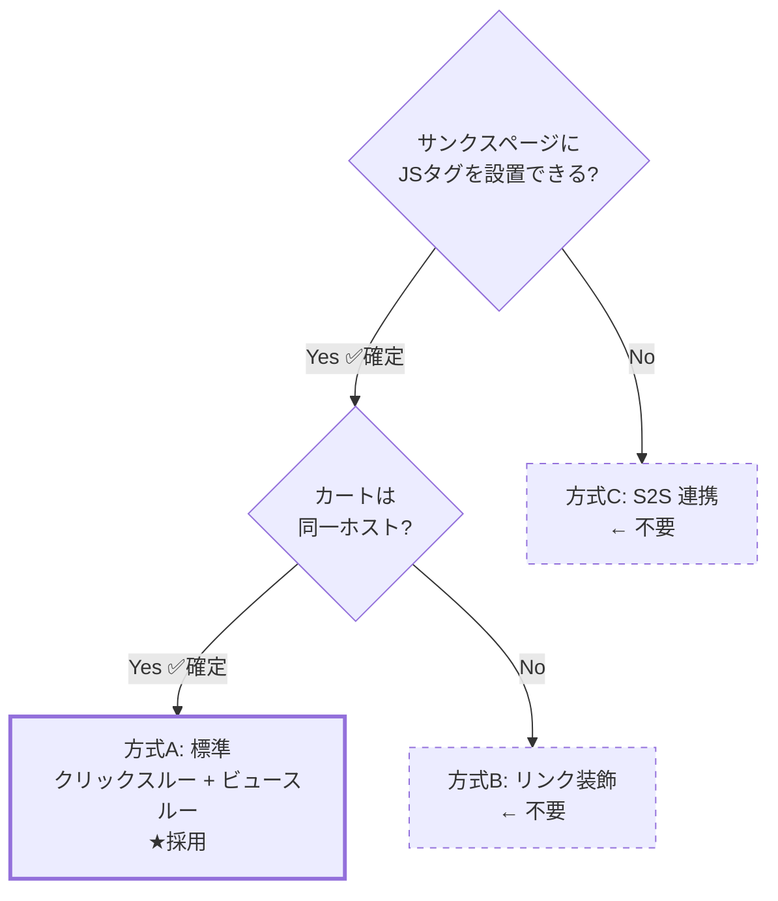
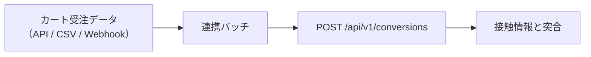
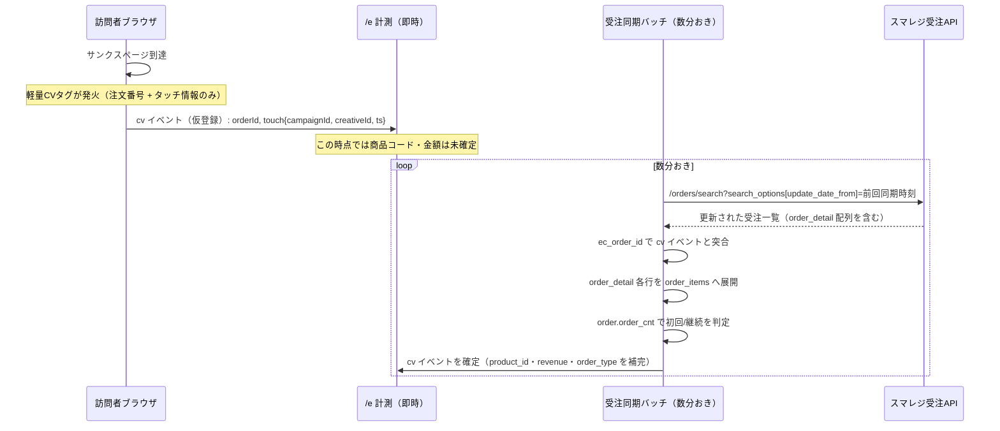
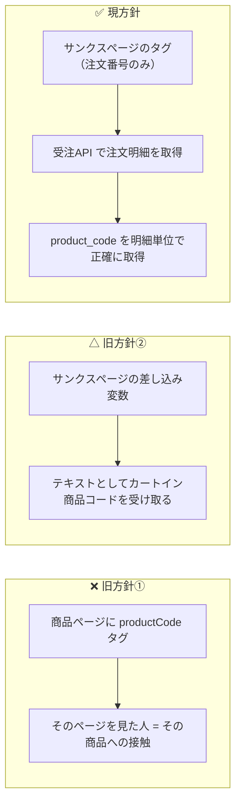

# 09. カート連携（スマレジ・リピート）

## 1. 前提と未確認事項

スマレジ・リピートは単品リピート通販（定期購入）向けのカートシステムです。
本設計は以下を前提に組んでいますが、**実装着手前に管理画面上で実機確認が必要**です。

### 1.1 チェックリスト（確認結果反映済み）

初期設置対象サイト: **https://www.primedirect.jp/** （株式会社プライムダイレクト）

| # | 確認事項 | 設計への影響 | 状態 |
| --- | --- | --- | --- |
| 1 | サンクスページ（ご注文完了）に**任意の JS タグを設置できるか** | 不可なら S2S 連携が必須になる | **✅ 可能** |
| 2 | タグ内で**注文番号・金額などの独自差し込み変数**が使えるか | 使えないと重複排除と売上計測ができない | **✅ 可能** |
| 3 | カート / サンクスページの**ホスト名** | 別ホストならリンク装飾が必須。ビュースルー CV は不可 | **✅ 確認済み → 全ステップ同一ホスト（下記 1.2）** |
| 2b | 差し込み変数の**正確な変数名** | CV タグの実装に直結 | 🔲 要取得（後日回答予定） |
| 6 | 商品ページ / LP は `www.primedirect.jp` 側か | タグ設置箇所とターゲティング設計 | **✅ 確認済み → 同一ホスト（下記 1.4）** |
| 8 | 定期購入の **2 回目以降の受注**も CV タグが発火するか | CV の定義（下記 3 章） | 🔲 要確認 |

> 残る未確認は **#2b（差し込み変数名）と #8（定期継続時の CV タグ発火）の 2 点のみ**。
> どちらも Phase 1 の実装と並行して確認できます。

> #1〜#3 が確定したことで、**方式C（S2S 連携）も方式B（リンク装飾）も不要**になりました。
> **方式A（標準構成）で確定**です。残るのは差し込み変数名と定期購入の挙動確認のみで、
> どちらも Phase 1 の実装と並行して進められます。

### 1.2 実機確認の結果（2026-08-11 実施）

購入フローを実際に進め、各画面の URL を取得しました。

| 画面 | URL |
| --- | --- |
| カート | `https://www.primedirect.jp/cart/?product_id=4212&transactionid=...` |
| お客様情報入力 | `https://www.primedirect.jp/shopping/` |
| お支払い方法 | `https://www.primedirect.jp/shopping/payment.php` |
| 注文確認 | `https://www.primedirect.jp/shopping/confirm.php` |
| ご注文完了 | `https://www.primedirect.jp/shopping/complete.php` |

**全ステップが `www.primedirect.jp` の単一ホストです。** → **方式A（標準構成）採用確定**。

追加で判明した仕様（設計への反映）:

- 個別注文は `transactionid`（トランザクション ID）というクエリパラメータで識別される
  → 商品ページ・カート・サンクスページが同一ホストのため、
    このパラメータを計測に使う必要はない（`visitorId` ベースの標準計測で十分）
- カートは `/cart/`、購入手続きは `/shopping/` 配下に集約されている
  → `allowedHosts` は `www.primedirect.jp` の 1 つのみで足りる。`cartHosts` の別設定は不要
- 配信除外パスとして `/cart/` `/shopping/` を初期設定に追加（`4.1` 節で反映）

### 1.3 商品ページの URL 確認結果 → 商品識別の方針を確定

例として頂いた 2 URL について、確認いただいた結果です。

| URL | ご回答 |
| --- | --- |
| `https://www.primedirect.jp/products/pm100/` | **`pm100` は商品コードではない**（URL 上のスラッグに過ぎない） |
| `https://www.primedirect.jp/protein.html` | **LP（複数商品を横断する紹介ページ）** |

**この結果を受けて、商品の識別方法を方針転換します。**

> ❌ 旧方針: 商品ページに商品コードタグを設置し、そのページを見た人 ＝ その商品への接触、とみなす
> ✅ 新方針: **実際にカートに入った商品コード**だけを商品の正とする
> （具体的な取得元は、その後の受注API 確認結果を踏まえ 3〜4 章で確定しています）

理由は単純です。**「どのページを見たか」と「実際に何を買ったか」は必ずしも一致しません。**
`pm100` のような URL 上の記号は商品を正しく表さず、`/protein.html` に至っては
複数商品が並ぶ LP なので、そもそも 1 商品に紐づけようがありません。
ページ側で商品を特定しようとする設計は、この時点で無理があったということです。

**カートイン商品コード方式に変えたことで得られるもの:**

- ページの URL 構造がどんなに複雑でも（商品ページ・LP が混在していても）影響を受けない
- 「実際に売れた商品」を正確に集計できる（ページ推測に基づく誤差が原理的にゼロになる）
- 商品ページに新しいタグを追加で設置する必要が**なくなる**（設置工数が減る）

**変わること:**

- 商品別レポートは **CV と売上のみ**を表示します（imp / click は持てません。
  「見られた回数」はページ側の情報が必要ですが、そのページと実購入商品の対応が
  取れない以上、正確な数字を出せないためです）
- 「どのページがよく見られ、クリックされたか」は**ページ別レポート**（URL ベース）で見ます。
  これは商品と紐付かない、純粋なエンゲージメント指標です
- キャンペーンの配信対象指定（対象ページ）も、商品コードではなく**URL ルールのみ**で行います
  （`06-admin.md` 2 章）

詳細な設計は `03-data-model.md`「商品（product_id）とページ（page_group_id）は
別軸として持つ」、CV タグの実装例は 4 章を参照してください。

### 1.4 参考: 公開情報から分かった範囲

| URL | 備考 |
| --- | --- |
| `/products/list.php` | 商品一覧。`.php` の拡張子付き構造 |
| `/entry/` | 会員登録 |
| `/category/` | カテゴリ一覧 |
| `/guide.html` `/store_faq.html` | 静的ページ |

- 商品ページの URL 形式（`/products/detail.php?product_id=` 形式か等）は #6 で確認予定。
  ただし**商品コードはタグから受け取るため、URL 形式は集計に影響しません**
- 注意: `/ecoca.html` は「エコカ」という**商品（ショッピングカート本体）**のページであり、
  カートシステムのページではありません

## 2. 計測方式の分岐



**プライムダイレクトの購入フローは全ステップ `www.primedirect.jp` の単一ホストのため、
方式A（標準構成）で確定しました。** `pz_t` によるリンク装飾も、署名の仕組みも不要です。
以降の節は参考情報として残しますが、実装では方式A のみを対象にします。

### 方式A: 同一ドメイン（★採用・プライムダイレクトはこれ）

`05-tag-sdk.md` の標準構成そのまま。localStorage の接触情報がそのまま読めるため、
クリックスルー CV・ビュースルー CV の**両方**が計測できます。
`pz_t` によるリンク装飾も、HMAC 署名の検証も不要です。実装が最も単純になります。

### 方式B: 別ドメイン + リンク装飾（不採用・参考情報として保持）

バナーのリンク先 URL に署名付きの接触情報を付与して引き継ぎます。

#### 送出側（LP・商品ページ）

```
元のリンク先:  https://cart.smaregi-repeat.example/item/1001
実際の遷移先:  https://cart.smaregi-repeat.example/item/1001?pz_t=eyJ2aWQiOi...
```

`pz_t` のペイロード（base64url された JSON）:

```jsonc
{
  "vid": "v_a1b2c3",       // visitorId
  "sid": "s_d4e5f6",       // sessionId
  "cid": 501,              // campaignId
  "crid": 9002,            // creativeId
  "pc": "1001",            // productCode（接触した商品ページ）
  "ts": 1786500000,        // 接触時刻（秒）
  "sig": "9f2a..."         // HMAC-SHA256（先頭 16 バイト）
}
```

- `sig` = HMAC(サイト秘密鍵, `vid|sid|cid|crid|ts`)。**秘密鍵はサーバのみが保持**し、
  署名は計測受信時に検証する（クライアントには鍵を配布しない）
- 署名生成はクリック時にサーバ往復すると遷移が遅れるため、
  **配信設定 JSON に「短命の署名済みトークン」を含めて配布**する方式を採る
  （設定 JSON はセッション単位ではないため、`vid/sid` は含めず `cid|crid|発行日` で署名し、
  改ざん検知の対象をキャンペーン・クリエイティブ・日付に限定する）

#### 受取側（カート・サンクスページ）

共通タグを設置し、SDK が起動時に以下を行います。

```ts
const t = new URLSearchParams(location.search).get('pz_t');
if (t) {
  const touch = decodeTouch(t);              // 形式・有効期限（7日）を検証
  saveTouch(touch);                          // カートオリジンの localStorage に保存
  history.replaceState({}, '', stripParam(location.href, 'pz_t')); // URL から除去
}
```

- カート内を回遊しても失われないよう、**localStorage に保存**（URL 依存にしない）
- サンクスページで CV タグが発火した際、この `touch` を CV イベントに添付する

#### レポート上の扱い

- ビュースルー CV は**列ごと非表示**にする（0 件表示は「効果がなかった」と誤読される）
- 管理画面のサイト設定に `crossDomainCart: true` を持たせ、UI を切り替える

### 方式C: S2S 連携（不採用・参考情報として保持）

サンクスページにタグを設置できない場合、受注データから CV を送信します。



突合キーの候補（上から優先）:

1. **注文時に `pz_t` を注文メモ / カスタム項目へ引き継げる場合** — 最も正確
2. `visitorId` をフォームの hidden 項目に埋め込める場合
3. 上記が不可なら、**注文時刻ベースの確率的突合は行わない**（精度が担保できないため）。
   この場合は個別 CV の帰属を諦め、**holdout による全体増分効果のみ**を計測する

> 3 の状態でも「ポップアップに効果があったか」は判定できます。
> 対照群と表示群の CV 数を比較すればよく、個別の紐付けは不要だからです。
> クリエイティブ別 CV は出せなくなりますが、**クリエイティブ別の CTR は出せる**ため、
> 運用上の意思決定（どのバナーを残すか）は継続できます。

## 3. 定期購入における CV の定義

単品リピート通販では「CV とは何か」を明確にする必要があります。

| 定義 | 内容 | 推奨 |
| --- | --- | --- |
| 初回注文のみ | 新規獲得を CV とする | **推奨（既定）** |
| 全注文 | 2 回目以降の定期継続も CV に含む | 非推奨（ポップアップの寄与ではない継続分が混入する） |
| 定期申込のみ | 単発購入を除外し定期コースの申込だけを CV とする | 事業 KPI 次第で選択可 |

判定には受注 API の `order.order_cnt`（購入回数）を使います（3.2 節）。

### 3.1 CV タグの実装 → 方式変更（受注API を正データ源にする）

> **設計変更**: いただいた「受注API」の仕様（スマレジEC・受注API、
> `https://www.primedirect.jp/api/v2/orders/search`）を確認したところ、
> **サンクスページの差し込み変数より、はるかに正確で頑丈な連携方法**が使えることが
> 分かりました。商品コード・金額・購入回数を**構造化データとして直接取得**できるためです。

**方針転換:**

```
❌ 旧方針: サンクスページの差し込み変数（{{商品合計金額}} 等）をテキストとして受け取り、
          パースして使う（未展開・書式ゆれ・型崩れのリスクが常につきまとう）
✅ 新方針: サンクスページのタグは「注文番号」だけを送る軽量な役割に絞り、
          商品コード・金額・購入回数などの正確な値は
          受注API から後追いで取得して補完する
```

理由:

- `order_detail`（購入明細）は**配列**で返るため、**1 注文に複数商品が含まれる場合も
  そのまま正しく扱えます**（4.3 節の「要確認」だった論点が、これで解消します）
- `order_detail.product_code`（ご購入明細商品コード）がまさに探していた
  「カートイン商品コード」そのもので、明細単位の正確な値が取れます
- `order.order_cnt`（購入回数）で初回 / 継続を判定でき、
  差し込み変数の表記ゆれ（`1`/`初回`/`新規`...）を推測する必要がなくなります
- 金額は `order_detail.product_total`（明細金額）から取得するため、
  `¥5,400` のような書式付きテキストをパースする処理が不要になります
- サンクスページ側のタグが軽量になり、**設置ミスの起きる余地が大幅に減ります**

### 3.2 新しい CV 計測パイプライン



**この方式の利点:**

- アトリビューション（どのキャンペーン・クリエイティブ経由の CV か）は、
  従来どおり**サンクスページ到達時点で即座に**タッチ情報から決まる（リアルタイム性を維持）
- 商品・金額・購入回数などの**事実データは受注APIから取得**するため、
  正確性が担保される（テキストパースに起因する誤集計が構造的に起きない）
- 1 注文複数商品にも標準対応（4.3 節で挙げた懸念が解消）

### 3.3 軽量 CV タグの実装

サンクスページに設置するタグは、**注文番号 1 つだけ**を送れば足ります。

```html
<!-- 共通タグ（未設置なら先に設置） -->
<script async src="https://cdn.popup.example.com/t.js?sid=SITE_XXXX"></script>

<!-- コンバージョンタグ（軽量版） -->
<script>
(function () {
  window.pqz = window.pqz || [];
  var orderId = '{{EC注文番号}}';   // ★ order.ec_order_id に対応する変数名を設置時に確認
  if (!orderId || orderId.indexOf('{{') !== -1) return;   // 未展開なら送信しない

  window.pqz.push(['conversion', { orderId: orderId }]);
})();
</script>
```

- 必要な差し込み変数は**「EC注文番号」1 つのみ**（受注API の `search_options.ec_order_id`
  で検索できる値と一致させる。3.4 節参照）
- 金額・商品コード・初回/継続の判定はすべて受注API 側から後追いで補完するため、
  このタグに書式パース処理は不要
- サンクスページのリロードによる二重発火は、`site_id + order_id` の
  部分ユニークインデックスでサーバ側が排除する

### 3.4 受注APIとの連携設計

```
GET/POST https://www.primedirect.jp/api/v2/orders/search
Authorization: Bearer {access_token}

search_options:
  ec_order_id: "{確定させたい注文番号}"   ← 個別確認時
  update_date_from: "{前回同期時刻}"      ← 定期同期時（数分〜十数分おき）
  response_options: { response_type: "json" }
```

取得したレスポンスから、1 注文あたり以下を抽出します。

| 受注APIの項目 | 用途 |
| --- | --- |
| `order.ec_order_id` | CV タグから送られた `orderId` との突合キー |
| `order.order_cnt`（購入回数） | `1` なら `orderType = 'first'`、それ以外は `'recurring'` |
| `order.order_date` | CV の発生時刻（`occurred_at`） |
| `order.total` / `order.total_notax` | 注文全体の売上金額 |
| `order.payment_status` | 決済未完了の受注を除外する場合のフィルタ |
| `order_detail[].product_code` | ★ 商品別レポートの商品コード（明細単位・配列） |
| `order_detail[].product_name` | 商品マスタへの自動登録時の表示名 |
| `order_detail[].product_quantity` | 数量 |
| `order_detail[].product_total` | その明細の金額（複数商品時の売上按分に使う） |
| `order_detail[].product_reg_flag` | 明細ごとの「定期」／「商品」区分。任意で `planType` に利用 |

> **要確認**: `order.order_cnt`（購入回数）が「その顧客の通算注文回数」を表し、
> `1` の場合に初回注文と判定してよいかを確認してください（3.5 節）。

### 3.5 実装のために確認したいこと（差し込み変数の代わりに、こちらをお願いします）

受注API の仕様を頂いたことで、**サンクスページの差し込み変数を細かく確認する必要は
なくなりました。** 代わりに、以下を確認させてください。

| # | 確認事項 | 備考 |
| --- | --- | --- |
| 1 | **API アクセストークンの発行方法**（管理画面のどこで発行するか・権限スコープ） | 実装に必須 |
| 2 | サンクスページで `order.ec_order_id`（EC注文番号）を出力する**差し込み変数名** | 唯一必要な差し込み変数 |
| 3 | `order.order_cnt`（購入回数）は「その顧客の通算注文回数」で合っているか | 初回/継続判定に使うため |
| 4 | 受注APIの**呼び出しレート制限**（1 分あたり・1 日あたりの上限） | 同期バッチの間隔設計に影響 |
| 5 | 受注データが確定するまでの**タイムラグ**（注文直後に search API で即座に引けるか、反映まで時間がかかるか） | CV 確定までの遅延に影響 |

> API 発行画面のスクリーンショットや、テスト用の `access_token` を頂ければ、
> 実データでの動作確認（3.4 節の突合ロジック）まで一気に進められます。

## 4. 商品の識別方式（確定：受注API のカートイン商品コード方式）

### 4.1 何が変わったか（2 段階の方針転換）

1.3 節の確認結果（`pm100` は商品コードでない・`protein.html` は LP）を受けて、
一度は「サンクスページの差し込み変数からカートイン商品コードを受け取る」方式に
転換しましたが、**受注API の仕様を頂いたことで、さらに正確な方式に更新しました。**



商品ページ・LP には**商品コードタグを設置しません**。
imp / click は URL ベースの `page_groups` で分類し（エンゲージメント集計）、
商品別の売上・CV は**受注API から取得した `order_detail[].product_code`** のみで
集計します（`03-data-model.md` 参照）。CV タグの実装は 3.3 節を参照してください。

### 4.2 1 注文に複数商品が含まれる場合（解決済み）

以前は「要確認」としていましたが、受注API の `order_detail` が**配列**で
返る仕様のため、**最初から標準対応できます。**

- 1 注文に複数の `order_detail` 行がある場合、**行ごとに商品コード・数量・金額が
  取れる**ため、商品ごとに売上を正確に按分できます
- `order_items` テーブル（`03-data-model.md`）に、注文明細を 1 行 1 レコードとして
  そのまま保存します。Phase 1 から複数商品注文に対応できます

### 4.3 ターゲティングへの影響

キャンペーンの配信対象ページ指定は、商品コードではなく**URL ルールのみ**で行います
（`06-admin.md` 2 章）。ページから商品を確実に特定できない以上、
「この商品のページにだけ出す」という指定はできません。
「`/products/` 配下すべてに出す」「`/protein.html` にだけ出す」といった
**URL パターンでの指定**で運用します。

## 4.4 初期導入サイトの設定値（www.primedirect.jp）

Phase 1 で登録するサイト設定の初期値。

```jsonc
{
  "name": "プライムダイレクト",
  "allowedHosts": ["www.primedirect.jp", "primedirect.jp"],
  "cartHosts": [],              // 単一ホスト構成のため空でよい（cart モード自体を使わない）
  "crossDomainCart": false,     // ✅ 確定: 単一ホストのため false
  "timezone": "Asia/Tokyo",
  "cvClickWindowDays": 7,
  "cvViewWindowDays": 1,
  "cvCountRecurring": false,    // 初回注文のみを CV とする（order_cnt=1 判定）
  "orderApi": {
    "baseUrl": "https://www.primedirect.jp/api/v2/orders",
    "accessToken": "（サーバの秘密情報として保管。管理画面には表示しない）",
    "syncIntervalMinutes": 10   // 3.5 節のレート制限確認結果に応じて調整
  }
}
```

配信対象から**既定で除外**するページ（購入動線を妨げないため。1.2 の実機確認結果を反映）:

- `/cart/`（カート）
- `/shopping/`（お客様情報入力・お支払い方法・注文確認・ご注文完了 一式）
- 会員登録 (`/entry/`)、ログイン、マイページ

`www.primedirect.jp` は `www` 有無の両方を許可ホストに入れておきます
（リダイレクト設定によっては両方からイベントが届くため）。

初期登録するページグループ（エンゲージメント集計用。1.3 節参照）:

| 名前 | ルール |
| --- | --- |
| 商品詳細ページ全体 | 前方一致 `/products/` |
| protein.html（LP） | 完全一致 `/protein.html` |

## 5. 導入手順（顧客向け）

1. 管理画面でサイトを作成 → 共通タグを取得
2. 全ページの `</head>` 直前に共通タグを設置（プライムダイレクトは単一ドメインのため 1 種類のみ）
3. **サンクスページ**: 共通タグ + 軽量 CV タグ（注文番号のみ）を設置（3.3 節）
4. 管理画面で**受注API のアクセストークン**を登録（3.5 節で確認事項を頂き次第）
5. ページグループを設定（`/products/` 配下・`/protein.html` 等の URL ルール）
6. 管理画面の「タグ設置チェッカー」で受信確認
   - 共通タグ: 受信あり / なし
   - CV タグ（仮登録）: 受信あり / なし
   - 受注API 同期: 直近の同期成功時刻・突合成功件数
7. テスト表示（`?pz_preview=` 付き URL）で見た目を確認
8. テスト購入を 1 件行い、CV が仮登録 → 数分後に受注APIで商品コード・金額が
   確定することを確認 → 配信開始

## 6. 顧客サイトへの影響を抑える配慮

- カートページ・サンクスページでは**ポップアップを表示しない**のを既定にする
  （購入動線の妨害を防ぐ。設定で解除は可能）
- カート側に設置する共通タグは、`pz_t` 受け取りと CV 送信のみを行う軽量モードで動作させる
  （設定 JSON の取得はするが、トリガー監視・描画は行わない）
- スマレジ・リピート側のフォーム挙動に干渉しないよう、
  カートドメインでは `history.pushState`（戻るボタン検知）を**強制的に無効化**する
