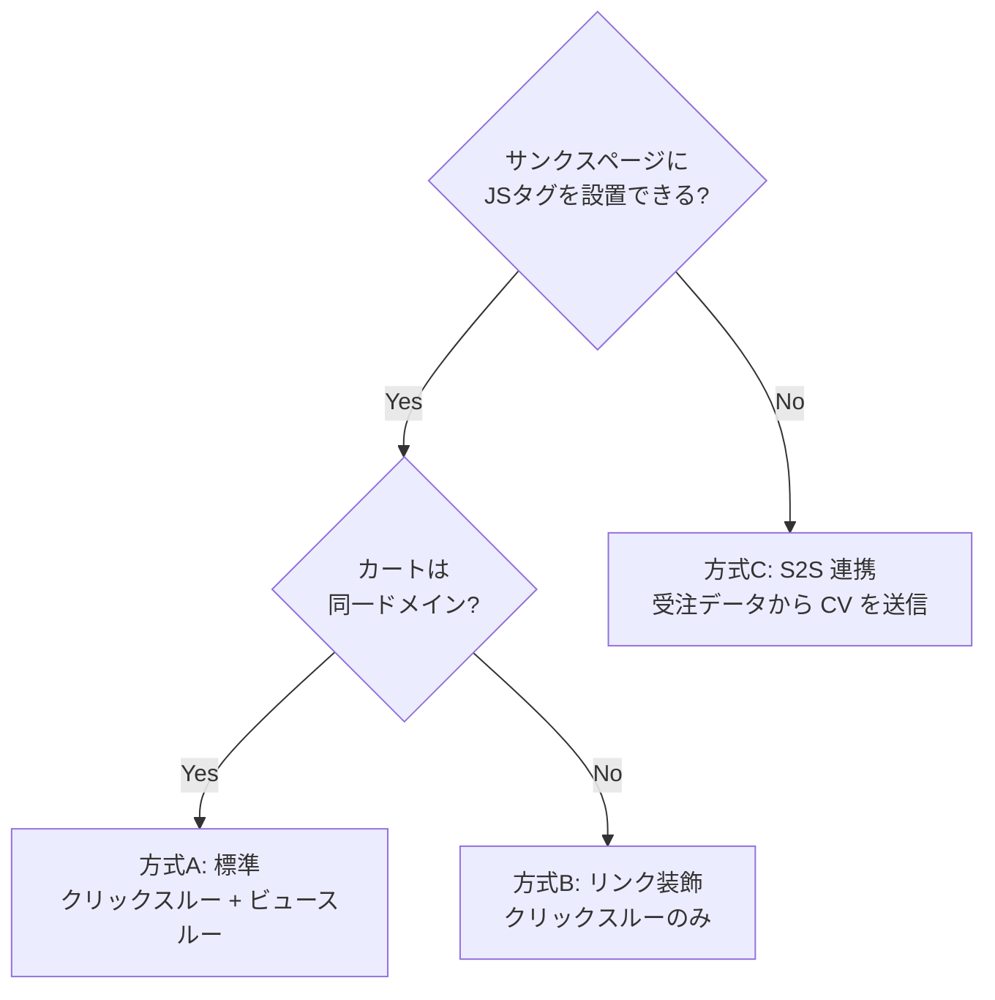
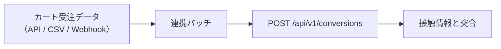

# 09. カート連携（スマレジ・リピート）

## 1. 前提と未確認事項

スマレジ・リピートは単品リピート通販（定期購入）向けのカートシステムです。
本設計は以下を前提に組んでいますが、**実装着手前に管理画面上で実機確認が必要**です。

### 1.1 導入前に必ず確認するチェックリスト

| # | 確認事項 | 設計への影響 | 状態 |
| --- | --- | --- | --- |
| 1 | サンクスページ（購入完了）に**任意の JS タグを設置できるか** | 不可なら S2S 連携が必須になる | 要確認 |
| 2 | タグ内で**注文番号・購入金額・商品コードの差し込み変数**が使えるか | 使えないと重複排除と売上計測ができない | 要確認 |
| 3 | カート / サンクスページの**ドメイン**（顧客独自ドメイン or カート事業者ドメイン） | 別ドメインならリンク装飾が必須。ビュースルー CV は不可 | 要確認 |
| 4 | カートページ URL に**クエリパラメータを付与して遷移できるか**（消されないか） | `pz_t` による接触情報の引き継ぎ可否 | 要確認 |
| 5 | **カゴ落ちメール等からの復帰導線**でパラメータが失われないか | 復帰 CV の帰属精度 | 要確認 |
| 6 | 商品ページ / LP は顧客ドメイン側か、カート側か | タグ設置箇所とターゲティング設計 | 要確認 |
| 7 | **受注データの API / CSV エクスポート**が可能か | S2S CV のフォールバック手段 | 要確認 |
| 8 | 定期購入の **2 回目以降の受注**も CV タグが発火するか | CV の定義（下記 3 章） | 要確認 |

> 1〜4 の回答次第で計測方式が変わります。**設計上は 3 通りすべてに対応可能な構成**に
> してあるため、確認結果が出てから実装方式を確定すれば手戻りは発生しません。

## 2. 計測方式の分岐



### 方式A: 同一ドメイン（理想）

`05-tag-sdk.md` の標準構成そのまま。localStorage の接触情報がそのまま読めるため、
クリックスルー CV・ビュースルー CV の両方が計測できます。

**カート側に独自ドメインを設定できるなら、この構成を最優先で選ぶべきです。**
計測精度が最も高く、実装も最も単純になります。

### 方式B: 別ドメイン + リンク装飾（現実解）

バナーのリンク先 URL に署名付きの接触情報を付与して引き継ぎます。

#### 送出側（LP・商品ページ）

```
元のリンク先:  https://cart.smaregi-repeat.example/item/1001
実際の遷移先:  https://cart.smaregi-repeat.example/item/1001?pz_t=eyJ2aWQiOi...
```

`pz_t` のペイロード（base64url された JSON）:

```jsonc
{
  "vid": "v_a1b2c3",       // visitorId
  "sid": "s_d4e5f6",       // sessionId
  "cid": 501,              // campaignId
  "crid": 9002,            // creativeId
  "pc": "1001",            // productCode（接触した商品ページ）
  "ts": 1786500000,        // 接触時刻（秒）
  "sig": "9f2a..."         // HMAC-SHA256（先頭 16 バイト）
}
```

- `sig` = HMAC(サイト秘密鍵, `vid|sid|cid|crid|ts`)。**秘密鍵はサーバのみが保持**し、
  署名は計測受信時に検証する（クライアントには鍵を配布しない）
- 署名生成はクリック時にサーバ往復すると遷移が遅れるため、
  **配信設定 JSON に「短命の署名済みトークン」を含めて配布**する方式を採る
  （設定 JSON はセッション単位ではないため、`vid/sid` は含めず `cid|crid|発行日` で署名し、
  改ざん検知の対象をキャンペーン・クリエイティブ・日付に限定する）

#### 受取側（カート・サンクスページ）

共通タグを設置し、SDK が起動時に以下を行います。

```ts
const t = new URLSearchParams(location.search).get('pz_t');
if (t) {
  const touch = decodeTouch(t);              // 形式・有効期限（7日）を検証
  saveTouch(touch);                          // カートオリジンの localStorage に保存
  history.replaceState({}, '', stripParam(location.href, 'pz_t')); // URL から除去
}
```

- カート内を回遊しても失われないよう、**localStorage に保存**（URL 依存にしない）
- サンクスページで CV タグが発火した際、この `touch` を CV イベントに添付する

#### レポート上の扱い

- ビュースルー CV は**列ごと非表示**にする（0 件表示は「効果がなかった」と誤読される）
- 管理画面のサイト設定に `crossDomainCart: true` を持たせ、UI を切り替える

### 方式C: S2S 連携（タグが置けない場合）

サンクスページにタグを設置できない場合、受注データから CV を送信します。



突合キーの候補（上から優先）:

1. **注文時に `pz_t` を注文メモ / カスタム項目へ引き継げる場合** — 最も正確
2. `visitorId` をフォームの hidden 項目に埋め込める場合
3. 上記が不可なら、**注文時刻ベースの確率的突合は行わない**（精度が担保できないため）。
   この場合は個別 CV の帰属を諦め、**holdout による全体増分効果のみ**を計測する

> 3 の状態でも「ポップアップに効果があったか」は判定できます。
> 対照群と表示群の CV 数を比較すればよく、個別の紐付けは不要だからです。
> クリエイティブ別 CV は出せなくなりますが、**クリエイティブ別の CTR は出せる**ため、
> 運用上の意思決定（どのバナーを残すか）は継続できます。

## 3. 定期購入における CV の定義

単品リピート通販では「CV とは何か」を明確にする必要があります。

| 定義 | 内容 | 推奨 |
| --- | --- | --- |
| 初回注文のみ | 新規獲得を CV とする | **推奨（既定）** |
| 全注文 | 2 回目以降の定期継続も CV に含む | 非推奨（ポップアップの寄与ではない継続分が混入する） |
| 定期申込のみ | 単発購入を除外し定期コースの申込だけを CV とする | 事業 KPI 次第で選択可 |

CV タグに `orderType` を渡して区別します。

```html
<script>
  pqz.push(['conversion', {
    orderId  : '{{注文番号}}',
    value    : {{商品金額}},
    currency : 'JPY',
    orderType: '{{初回 or 継続}}',   // 'first' | 'recurring'
    plan     : '{{定期 or 単発}}'    // 'subscription' | 'onetime'
  }]);
</script>
```

- 既定では `orderType = 'first'` のみを CV として集計
- レポートのフィルタで「初回のみ / すべて」を切り替え可能にする
- LTV 計測（継続回数・累計売上）は Phase 3 で検討。Phase 1 は初回獲得に絞る

## 4. 商品コードの受け渡し（確定：タグで渡せる）

商品ページに以下を設置します。

```html
<script>
  window.pqz = window.pqz || [];
  pqz.push(['page', {
    productCode: '{{商品コード}}',
    productName: '{{商品名}}',
    pageType   : 'product'          // 'product' | 'lp' | 'cart' | 'thanks' | 'other'
  }]);
</script>
```

### 設計への影響（当初案からの簡素化）

商品コードが確実に取れるため、当初設計にあった
**「URL パターンで商品ページを分類する `page_groups`」は主役から外します。**

| 当初案 | 変更後 |
| --- | --- |
| URL ルールで page_group を定義 → レポート集計軸 | **`productCode` をそのまま集計軸にする** |
| 管理画面でページグループを手動メンテ | 商品コードは受信時に**自動登録**（初出時に商品マスタへ upsert） |
| URL ルールの設定ミスで集計が壊れるリスク | リスクが消える |

`page_groups` は「商品ページ以外（LP・カート・記事ページ等）」を分類する
補助的な仕組みとして残します。ターゲティング（配信対象ページ指定）では
**商品コードによる指定**を第一候補にします。

```jsonc
// キャンペーンの配信対象指定（商品コード指定が可能に）
"targets": {
  "productCodes": { "include": ["1001", "1002"], "exclude": [] },
  "urls": { "include": [{ "match": "prefix", "pattern": "/lp/" }], "exclude": [] }
}
```

管理画面では「対象商品」を**受信済み商品コードのサジェスト付きマルチセレクト**で選べます。
URL を手打ちする必要がなくなり、設定ミスが構造的に減ります。

## 5. 導入手順（顧客向け）

1. 管理画面でサイトを作成 → 共通タグを取得
2. **顧客ドメイン側**: 全ページの `</head>` 直前に共通タグを設置
3. **商品ページ**: 商品コード受け渡しタグを設置（テンプレート変数で自動差し込み）
4. **スマレジ・リピート側**: 共通タグ + CV タグをサンクスページに設置
5. 管理画面の「タグ設置チェッカー」で受信確認
   - 共通タグ（顧客ドメイン）: 受信あり / なし
   - 商品コード: 受信済み商品コード一覧
   - 共通タグ（カートドメイン）: 受信あり / なし
   - CV タグ: 受信あり / なし
6. サイト設定で「カートドメイン」を登録（`allowed_hosts` に追加、`crossDomainCart` 判定）
7. テスト表示（`?pz_preview=` 付き URL）で見た目を確認
8. テスト購入を 1 件行い、CV が計上されることを確認 → 配信開始

## 6. 顧客サイトへの影響を抑える配慮

- カートページ・サンクスページでは**ポップアップを表示しない**のを既定にする
  （購入動線の妨害を防ぐ。設定で解除は可能）
- カート側に設置する共通タグは、`pz_t` 受け取りと CV 送信のみを行う軽量モードで動作させる
  （設定 JSON の取得はするが、トリガー監視・描画は行わない）
- スマレジ・リピート側のフォーム挙動に干渉しないよう、
  カートドメインでは `history.pushState`（戻るボタン検知）を**強制的に無効化**する
