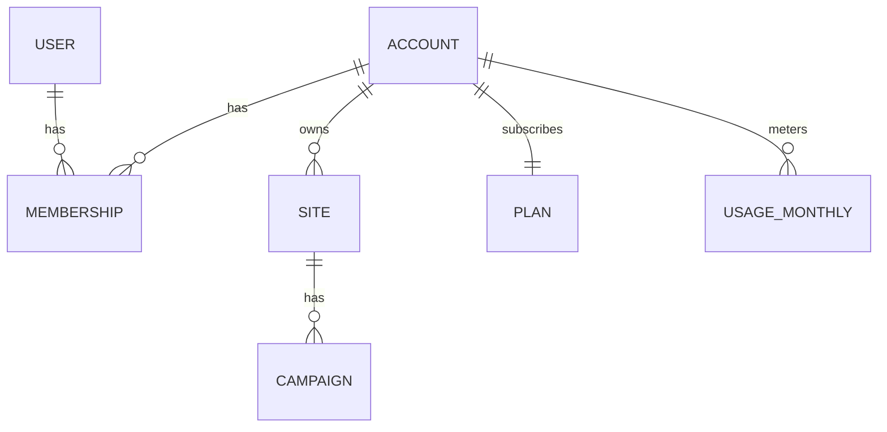

# 10. マルチテナント設計（SaaS）

## 1. テナントモデル



| 階層 | 意味 |
| --- | --- |
| **Account（テナント）** | 契約単位。請求・プラン・クォータの単位 |
| **User** | 人。メールアドレスで一意。**複数アカウントに所属できる** |
| **Membership** | User × Account の所属と権限（owner / editor / viewer） |
| **Site** | 計測単位。1 アカウントに複数サイト |

`User` と `Account` を多対多にしておく理由:

- 代理店 / 制作会社が複数クライアントのアカウントを 1 ログインで運用できる
- 社内担当者が複数ブランドのアカウントを持てる
- 後から「代理店機能」を作る際にスキーマ変更が不要

```sql
CREATE TABLE memberships (
  id         BIGSERIAL PRIMARY KEY,
  account_id BIGINT NOT NULL REFERENCES accounts(id) ON DELETE CASCADE,
  user_id    BIGINT NOT NULL REFERENCES users(id) ON DELETE CASCADE,
  role       TEXT NOT NULL CHECK (role IN ('owner','editor','viewer')),
  invited_by BIGINT REFERENCES users(id),
  accepted_at TIMESTAMPTZ,
  created_at TIMESTAMPTZ NOT NULL DEFAULT now(),
  UNIQUE (account_id, user_id)
);
```

`users` から `account_id` / `role` カラムは削除し、`memberships` に移します
（`03-data-model.md` の当初案からの変更点）。

## 2. データ分離：PostgreSQL Row Level Security

アプリ層の `WHERE account_id = ?` だけに頼ると、**書き漏らし 1 箇所でテナント越境**します。
SaaS では致命的な事故になるため、**DB レベルで強制**します。

```sql
ALTER TABLE campaigns ENABLE ROW LEVEL SECURITY;
ALTER TABLE campaigns FORCE ROW LEVEL SECURITY;

CREATE POLICY tenant_isolation ON campaigns
  USING (site_id IN (
    SELECT id FROM sites
    WHERE account_id = current_setting('app.account_id')::bigint
  ));
```

- リクエストごとにトランザクション開始時 `SET LOCAL app.account_id = ...` を発行
- この設定を行うのは**認証ミドルウェア 1 箇所のみ**
- `FORCE ROW LEVEL SECURITY` によりテーブル所有者にもポリシーを適用
- 集計バッチなど横断処理は専用ロール（`BYPASSRLS`）で実行し、そのロールは Web からは使わない

### テスト

- **全テナント越境テストを自動化**: テナント A のセッションでテナント B のリソース ID を
  直接指定した API 呼び出しを行い、404 が返ることを全エンドポイントで検証
- 新しいテーブルを追加したのに RLS を有効化し忘れるのを防ぐため、
  **RLS 未設定のテーブルを検出する CI チェック**を入れる

```sql
-- CI で実行：RLS 未設定のテナントテーブルがあれば失敗
SELECT tablename FROM pg_tables t
WHERE schemaname = 'public'
  AND tablename NOT IN ('accounts','users','plans','schema_migrations')
  AND NOT EXISTS (
    SELECT 1 FROM pg_class c WHERE c.relname = t.tablename AND c.relrowsecurity
  );
```

## 3. 計測エンドポイントのテナント解決

計測 `/e` は未認証の公開エンドポイントです。テナントは `sitePublicId` から解決します。

```
sitePublicId → sites → account_id
```

セキュリティ上の要点:

| 論点 | 対策 |
| --- | --- |
| 他社の sitePublicId を騙って偽イベントを送る | `Origin` を `sites.allowed_hosts` と照合。不一致は破棄 |
| sitePublicId の推測 | 26 文字のランダム文字列（連番にしない） |
| 大量送信によるコスト攻撃 | サイト単位・IP 単位のレート制限。プランのクォータ超過で受信停止 |
| イベント書き込み時の account_id 取り違え | `sitePublicId` の解決結果のみを信頼し、リクエストボディの `accountId` は受け付けない |

`sitePublicId → site` の解決はホットパスのため、アプリ内 LRU キャッシュ（TTL 60 秒）を置きます。

## 4. プランとクォータ

```sql
CREATE TABLE plans (
  code            TEXT PRIMARY KEY,        -- 'free' | 'standard' | 'pro'
  name            TEXT NOT NULL,
  max_sites       INT NOT NULL,
  max_users       INT NOT NULL,
  max_campaigns   INT NOT NULL,
  monthly_imp_quota BIGINT NOT NULL,
  storage_mb      INT NOT NULL,
  features        JSONB NOT NULL DEFAULT '{}'  -- {"holdout":true,"s2sCv":false,"csvExport":true}
);

CREATE TABLE usage_monthly (
  account_id BIGINT NOT NULL REFERENCES accounts(id),
  month      DATE NOT NULL,               -- 月初日
  imps       BIGINT NOT NULL DEFAULT 0,
  clicks     BIGINT NOT NULL DEFAULT 0,
  cvs        BIGINT NOT NULL DEFAULT 0,
  storage_mb INT NOT NULL DEFAULT 0,
  PRIMARY KEY (account_id, month)
);
```

### クォータ超過時のふるまい

段階的に扱い、**いきなり配信を止めない**（顧客サイトの体験を壊さないため）。

| 到達率 | ふるまい |
| --- | --- |
| 80% | 管理画面にバナー表示 + owner にメール通知 |
| 100% | 管理画面に警告。**配信・計測は継続**（超過分は請求 or 翌月調整） |
| 120% | owner に再通知。営業側でプラン変更を案内 |
| 150% | 新規キャンペーンの作成を停止（既存配信は継続） |

配信そのものを止めるのは、**支払い停止による契約終了時のみ**とします。
その場合も設定 JSON を「キャンペーン 0 件」で返すことで、
顧客サイトにエラーを出さずに静かに停止します。

## 5. アカウント切替 UI

- ヘッダー左に アカウント切替ドロップダウン（所属が 1 件のみなら非表示）
- URL に アカウントを含める: `/a/{accountSlug}/sites/{siteId}/campaigns`
  → ブックマーク・共有時に文脈が失われない
- アカウント切替時はセッションの `app.account_id` を差し替え、所属を再検証

## 6. 監査ログ

SaaS では「誰がいつ配信を止めたか」が問い合わせ対応で必須になります。

```sql
CREATE TABLE audit_logs (
  id         BIGSERIAL PRIMARY KEY,
  account_id BIGINT NOT NULL,
  user_id    BIGINT,
  action     TEXT NOT NULL,         -- 'campaign.publish' | 'campaign.pause' | ...
  target_type TEXT NOT NULL,
  target_id  BIGINT,
  diff       JSONB,                 -- 変更前後
  ip         INET,
  user_agent TEXT,
  created_at TIMESTAMPTZ NOT NULL DEFAULT now()
);
```

記録対象: ログイン / メンバー招待・削除 / 権限変更 / キャンペーン作成・更新・公開・停止 /
クリエイティブ変更 / サイト設定変更 / データ削除。保持 13 ヶ月。

## 7. オンボーディング

新規アカウント作成から初回配信までを 1 本のフローにします。

```
1. サインアップ（メール認証）
2. アカウント名・サイト URL 入力
3. 共通タグをコピー → 設置
4. 設置チェッカーが受信を検知（ポーリング）→ 自動で次へ
5. 商品コードタグ / CV タグ の設置ガイド（スマレジ・リピート向け手順を表示）
6. サンプルキャンペーンをテンプレートから作成
7. テスト表示 → 配信開始
```

- 手順 4 で詰まる顧客が最も多いため、**「まだ受信していません」の画面に
  よくある原因（タグの設置位置、キャッシュ、許可ホスト未登録）を併記**する
- カート種別を選ばせ（スマレジ・リピート / その他）、専用の設置手順を出す

## 8. 運用（内部管理）

自社スタッフ用の内部管理画面を別途用意します（顧客からはアクセス不可）。

- アカウント一覧・プラン変更・利用状況
- 顧客アカウントへの**なりすましログイン**（サポート用。監査ログに必ず記録し、
  実行中は管理画面上部に警告バーを常時表示）
- 全テナント横断のイベント受信状況・エラー率モニタ
- SDK バージョンごとの配信割合（段階リリース用）

## 9. SDK の段階リリース

顧客サイトに直接埋め込まれる SDK の不具合は、複数テナントへ同時に波及します。

- ローダは設定 JSON 内の `sdkUrl` を読んでロードする
- 新バージョンは **内部テストサイト → 自社アカウント → 10% のテナント → 全体** の順で展開
- 設定 JSON の `sdkUrl` を戻すだけでロールバック可能（デプロイ不要・数分で反映）
- SDK 例外は Sentry で `siteId` タグ付きで収集し、特定テナントでのみ発生する不具合を検知
