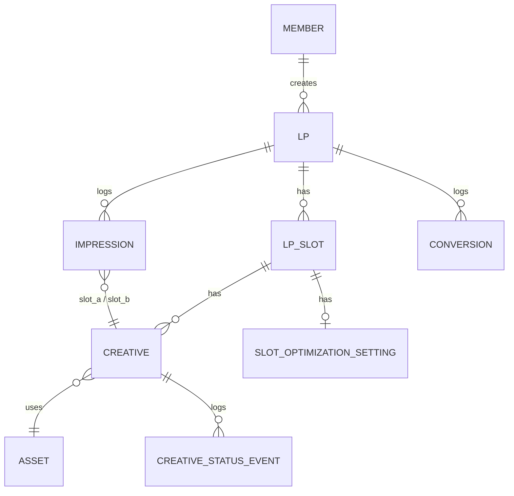

# 01. データモデル（案）

> Supabase Postgres。RLSでテナント分離は行わない（社内単一組織のため、
> `members.role` によるアプリケーションレベルの権限制御のみで十分と判断）。
> ただし将来の拡張に備え、`created_by` 等の監査列は最初から持たせる。

## 1. ER概要



## 2. メンバー・権限

```sql
-- Supabase Auth の auth.users を参照する薄いプロファイルテーブル
CREATE TABLE members (
  id           UUID PRIMARY KEY REFERENCES auth.users(id) ON DELETE CASCADE,
  email        CITEXT NOT NULL UNIQUE,
  role         TEXT NOT NULL CHECK (role IN ('admin','editor','viewer')),
  invited_by   UUID REFERENCES members(id),
  invited_at   TIMESTAMPTZ NOT NULL DEFAULT now(),
  accepted_at  TIMESTAMPTZ,          -- 初回ログインで埋まる
  created_at   TIMESTAMPTZ NOT NULL DEFAULT now()
);
```

- 自己登録なし。`admin` がメールアドレスを `invited_at` 付きで先に作成し、
  Google認証（`@primedirect.jp` ドメイン限定）で本人が初回ログインした時点で
  `accepted_at` を埋める（popup toolの招待フローと同じ考え方）
- 未招待メールアドレスでの認証はアプリ側で拒否する

## 3. LP

```sql
CREATE TABLE lps (
  id             BIGSERIAL PRIMARY KEY,
  product_code   TEXT NOT NULL,             -- 品番
  item_name      TEXT NOT NULL,             -- アイテム名
  lp_name        TEXT NOT NULL,             -- LP名
  url            TEXT NOT NULL,             -- LPのURL（差し替えタグの対象・popup tool連携のキー）
  top_image_url  TEXT,                      -- 一覧表示用のTOP画像（自動取得。取得できない場合はNULL）
  delivery_status TEXT NOT NULL DEFAULT 'active' CHECK (delivery_status IN ('active','paused')),
  created_by     UUID NOT NULL REFERENCES members(id),
  created_at     TIMESTAMPTZ NOT NULL DEFAULT now(),
  updated_at     TIMESTAMPTZ NOT NULL DEFAULT now()
);
CREATE INDEX ON lps (delivery_status);
CREATE INDEX ON lps (product_code);
CREATE INDEX ON lps (item_name);
```

- 一覧の絞り込み検索（品番/アイテム名/LP名）はこのテーブルへの `ILIKE` 検索で足りる規模想定
- `delivery_status='paused'` は一覧でグレー表示・デフォルト非表示（表示条件切替で表示）

## 4. スロット（差し替え箇所。LPごとに最大2件）

```sql
CREATE TABLE lp_slots (
  id                BIGSERIAL PRIMARY KEY,
  lp_id             BIGINT NOT NULL REFERENCES lps(id) ON DELETE CASCADE,
  slot_key          TEXT NOT NULL CHECK (slot_key IN ('a','b')),
  label             TEXT NOT NULL DEFAULT '',   -- 管理用の表示名（例:「ファーストビュー画像」）
  original_image_url TEXT NOT NULL,             -- 差し替え対象として指定した既存LP上の画像URL
  optimization_mode TEXT NOT NULL DEFAULT 'equal' CHECK (optimization_mode IN ('equal','auto')),
  created_at        TIMESTAMPTZ NOT NULL DEFAULT now(),
  UNIQUE (lp_id, slot_key)
);
```

- `slot_key` は `a` / `b` の2値のみ（要件上「最大2箇所」で固定のため列挙型で十分）
- スロット作成時に、`original_image_url` を指す「元画像」の `creatives` 行が
  `is_original = true` として自動生成される

## 5. アセット（アップロード画像。自動プレビュー・バリデーション用）

```sql
CREATE TABLE assets (
  id           BIGSERIAL PRIMARY KEY,
  original_key TEXT NOT NULL,           -- Supabase Storage 上のキー
  width        INT NOT NULL,
  height       INT NOT NULL,
  bytes        BIGINT NOT NULL,
  mime         TEXT NOT NULL,
  created_at   TIMESTAMPTZ NOT NULL DEFAULT now()
);
```

- アップロード時に、差し替え対象スロットの基準サイズ（元画像 or 既存パターンの平均）と
  比較し、幅・高さ・アスペクト比が大きく異なる場合は警告を出す（3章の画像バリデーション要件）
- 一覧・レポート・入稿画面のサムネイルは、このテーブルの画像を自動表示する

## 6. クリエイティブ

```sql
CREATE TABLE creatives (
  id             BIGSERIAL PRIMARY KEY,
  slot_id        BIGINT NOT NULL REFERENCES lp_slots(id) ON DELETE CASCADE,
  name           TEXT NOT NULL,
  asset_id       BIGINT REFERENCES assets(id),   -- is_original=true の場合は NULL（元画像は差し替え不要のため）
  is_original    BOOLEAN NOT NULL DEFAULT false,
  status         TEXT NOT NULL DEFAULT 'active' CHECK (status IN ('active','paused')),
  weight_percent NUMERIC(5,2) NOT NULL,           -- 実効表示率（0-100、同一slot内の合計は常に100）
  is_locked      BOOLEAN NOT NULL DEFAULT false,  -- true の場合、自動最適化の対象から除外(手動固定)
  created_by     UUID NOT NULL REFERENCES members(id),
  created_at     TIMESTAMPTZ NOT NULL DEFAULT now(),
  updated_at     TIMESTAMPTZ NOT NULL DEFAULT now()
);
CREATE INDEX ON creatives (slot_id, status);
```

- 1スロットあたり元画像込みで最大99件（アプリ側でバリデーション）
- `status='paused'` は配信対象から即除外・`weight_percent` は自動最適化バッチが再計算時に0扱い
  （停止フラグが常に最優先。5章 `optimize_slot_weights` 参照）
- そのslot内の`active`なクリエイティブが1件もない（＝全停止）場合は、アプリ側が
  「元画像100%」として配信する（`creatives`側のデータは変更しない。配信APIのフォールバック処理）

## 7. クリエイティブ状態変更履歴（監査ログ・カレンダー機能の土台）

```sql
CREATE TABLE creative_status_events (
  id           BIGSERIAL PRIMARY KEY,
  creative_id  BIGINT NOT NULL REFERENCES creatives(id) ON DELETE CASCADE,
  event_type   TEXT NOT NULL CHECK (event_type IN (
                 'created','activated','paused','weight_changed','locked','unlocked','optimized'
               )),
  weight_before NUMERIC(5,2),
  weight_after  NUMERIC(5,2),
  actor_id     UUID REFERENCES members(id),   -- 自動最適化バッチの場合は NULL
  occurred_at  TIMESTAMPTZ NOT NULL DEFAULT now()
);
CREATE INDEX ON creative_status_events (creative_id, occurred_at);
```

- LP詳細の「変更履歴」画面はこのテーブルをそのまま時系列表示すればよい
- **カレンダー式レポートの「帯」は、このテーブルから「その日時点でどのクリエイティブが
  activeだったか」を再構成して作る**（スナップショットテーブルは持たず、都度
  `creative_status_events` から状態を復元する設計。データ量が増えたら日次スナップショット
  テーブルへの切り替えを検討）

## 8. 自動最適化の設定

```sql
CREATE TABLE slot_optimization_settings (
  slot_id           BIGINT PRIMARY KEY REFERENCES lp_slots(id) ON DELETE CASCADE,
  min_impressions    INT NOT NULL DEFAULT 1000,  -- この件数を超えるまでは再配分の対象にしない
  min_conversions    INT NOT NULL DEFAULT 5,
  floor_mode         TEXT NOT NULL DEFAULT 'equal_share' CHECK (floor_mode IN ('equal_share','fixed_percent')),
  floor_percent      NUMERIC(5,2),               -- floor_mode='fixed_percent' の場合のみ使用
  last_run_at        TIMESTAMPTZ
);
```

- `floor_mode='equal_share'`：下限＝「均等割りした場合の割合」（例:3パターンなら約33%の
  半分など、実装時に係数を決める）とすることで、パターン数が多くても合計が100%を超えない
  ようにする。少数パターン運用が中心の間は `fixed_percent` で固定%運用も選べるようにしておく

## 9. 計測イベント

クリックは計測しないため、`imp` と `cv` の2種類のみ。1回のLP表示で
スロットA・スロットBのクリエイティブが同時に決定されるため、1テーブルに
両方の参照を持たせることで、スロット単体集計とA×Bクロス集計の両方に対応する。

```sql
CREATE TABLE impressions (
  id              BIGSERIAL PRIMARY KEY,
  occurred_at     TIMESTAMPTZ NOT NULL,
  lp_id           BIGINT NOT NULL REFERENCES lps(id),
  session_id      TEXT NOT NULL,             -- 1st-party ID（ブラウザ側で発行）
  creative_a_id   BIGINT REFERENCES creatives(id),  -- スロットAが無いLPはNULL
  creative_b_id   BIGINT REFERENCES creatives(id),  -- スロットBが無いLPはNULL
  device          TEXT CHECK (device IN ('pc','sp','tablet'))
);

CREATE TABLE conversions (
  id              BIGSERIAL PRIMARY KEY,
  occurred_at     TIMESTAMPTZ NOT NULL,
  lp_id           BIGINT NOT NULL REFERENCES lps(id),
  session_id      TEXT NOT NULL,             -- imp発生時のsession_idと突き合わせて配分を特定
  order_id        TEXT,
  revenue         NUMERIC(12,2),
  creative_a_id   BIGINT REFERENCES creatives(id),  -- session突合時点のスナップショット
  creative_b_id   BIGINT REFERENCES creatives(id)
);

CREATE UNIQUE INDEX ON conversions (lp_id, order_id) WHERE order_id IS NOT NULL;
CREATE INDEX ON impressions (lp_id, occurred_at DESC);
CREATE INDEX ON conversions (lp_id, occurred_at DESC);
```

（当初は月次range partitioningを想定していたが、Postgresはパーティション化テーブルの
UNIQUE制約にパーティションキーを含めることを要求するため、`(lp_id, order_id)`だけの
重複防止キーと両立できないと判明し撤回。このツールの規模では素の1テーブルで十分）

- CVはカート側のサンクスページに設置する**独立したCVタグ**から送信される
  （popup toolのCVタグとは別物。7章参照）。`session_id` はLP訪問時にブラウザに
  発行したものをサンクスページまで引き継ぐ（同一ドメイン運用前提。ドメインを跨ぐ場合は
  popup toolと同様のクエリ引き継ぎ方式を別途検討）
- `creative_a_id`/`creative_b_id` は、CV発生セッションが最後にimpした時点の組み合わせを
  スナップショットとして記録する（レポート集計時にJOINし直さなくて済むようにするため）

## 10. ロールアップ（レポート用）

```sql
CREATE TABLE stats_daily (
  date          DATE NOT NULL,
  lp_id         BIGINT NOT NULL,
  slot_key      TEXT NOT NULL,        -- 'a' | 'b' | 'all'（LP全体のサマリ行）
  creative_id   BIGINT NOT NULL DEFAULT 0,  -- 0 = そのslotの合計行
  imps          BIGINT NOT NULL DEFAULT 0,
  cv            BIGINT NOT NULL DEFAULT 0,
  revenue       NUMERIC(14,2) NOT NULL DEFAULT 0,
  PRIMARY KEY (lp_id, date, slot_key, creative_id)
);
```

- 日次Cronで `impressions`/`conversions` から集計（popup toolの`stats_daily`と同じ設計思想）
- A×Bクロス集計は、当日〜直近期間は `impressions`/`conversions` への都度クエリで対応し、
  規模が大きくなったら専用のクロス集計ロールアップを追加する（Phase 1では都度集計で十分な想定）
- 有意差フラグは、`stats_daily`のimps/cvから比率のZ検定（2群比較）をアプリ側で都度計算する
  想定（事前計算はしない。計算コストが低いため）

## 11. popup tool連携キャッシュ（任意・パフォーマンス用）

```sql
CREATE TABLE popup_link_cache (
  lp_id         BIGINT PRIMARY KEY REFERENCES lps(id) ON DELETE CASCADE,
  link_type     TEXT CHECK (link_type IN ('campaign','campaign_list','none')),
  campaign_id   BIGINT,             -- link_type='campaign' の場合のみ
  site_id       BIGINT,
  checked_at    TIMESTAMPTZ NOT NULL DEFAULT now()
);
```

- LP一覧・レポート一覧の表示のたびにpopup toolへAPIを叩くと遅くなるため、
  結果を短時間キャッシュする（TTLは実装時に決定。例：5分〜1時間）
- 詳細は [03-popup-integration.md](03-popup-integration.md)
